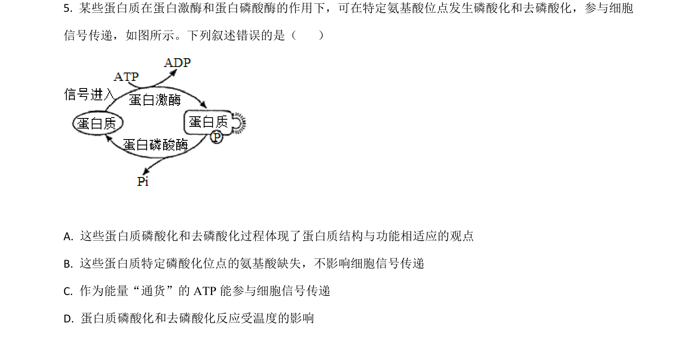
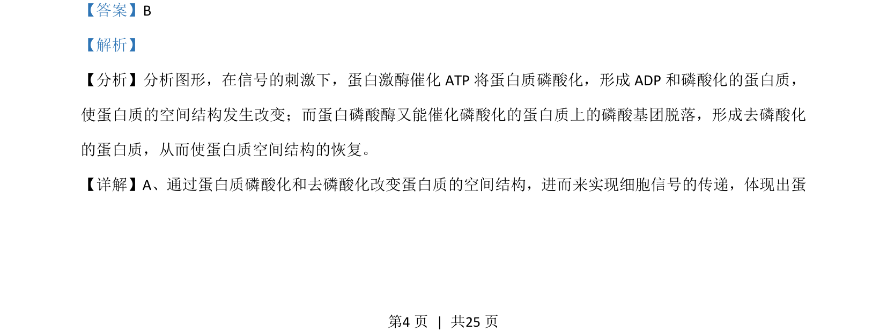
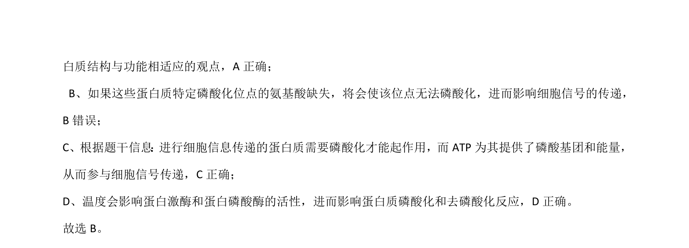

## 题面

## 摘要

蛋白质磷酸化与去磷酸化改变空间结构实现信号传递，综合判断相关叙述正误

## 关联考点

- [[927-蛋白质磷酸化|蛋白质磷酸化]]
- [[蛋白质去磷酸化]]
- [[信号传递]]
- [[234-ATP|ATP]]

## 答案与解析

> 📄 原 PDF 第 4 页：`素材/真题/湖南/2008-2024·（湖南）生物高考真题/2021年高考生物试卷（湖南）（解析卷）.pdf`
