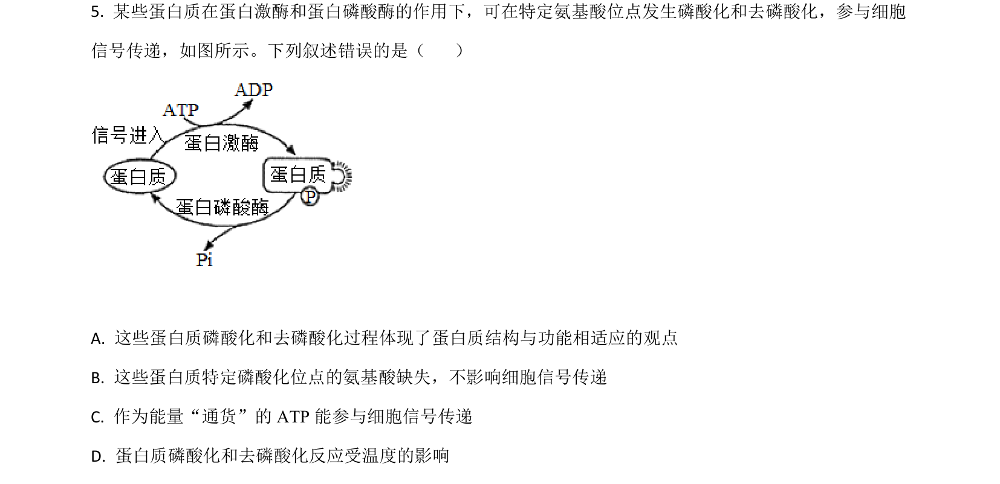
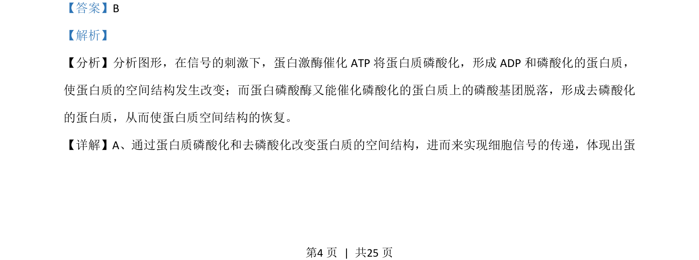
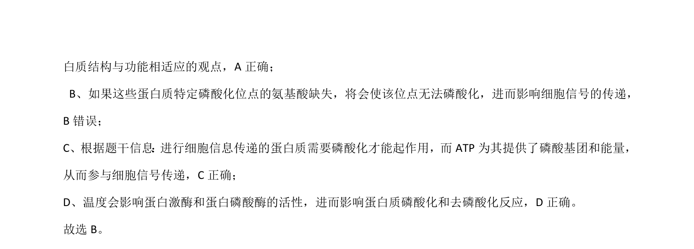

## 题面

## 摘要

蛋白质磷酸化与去磷酸化改变空间结构实现信号传递，综合判断相关叙述正误

## 关联考点

- [[927-蛋白质磷酸化|蛋白质磷酸化]]
- [[蛋白质去磷酸化]]
- [[信号传递]]
- [[234-ATP|ATP]]

## 答案与解析

> 📄 原 PDF 第 4 页：`素材/真题/湖南/2008-2024·（湖南）生物高考真题/2021年高考生物试卷（湖南）（解析卷）.pdf`

<!-- 题干文本-start -->
## 题干文本
5. 某些蛋白质在蛋白激酶和蛋白磷酸酶的作用下，可在特定氨基酸位点发生磷酸化和去磷酸化，参与细胞
信号传递，如图所示。下列叙述错误的是（    ）
A. 这些蛋白质磷酸化和去磷酸化过程体现了蛋白质结构与功能相适应的观点
B. 这些蛋白质特定磷酸化位点的氨基酸缺失，不影响细胞信号传递
C. 作为能量“通货”的 ATP 能参与细胞信号传递
D. 蛋白质磷酸化和去磷酸化反应受温度的影响
<!-- 题干文本-end -->

<!-- 解析文本-start -->
## 解析文本
【答案】B
【解析】
【分析】分析图形，在信号的刺激下，蛋白激酶催化 ATP 将蛋白质磷酸化，形成 ADP 和磷酸化的蛋白质，
使蛋白质的空间结构发生改变；而蛋白磷酸酶又能催化磷酸化的蛋白质上的磷酸基团脱落，形成去磷酸化
的蛋白质，从而使蛋白质空间结构的恢复。
【详解】A、通过蛋白质磷酸化和去磷酸化改变蛋白质的空间结构，进而来实现细胞信号的传递，体现出蛋
<!-- 解析文本-end -->
