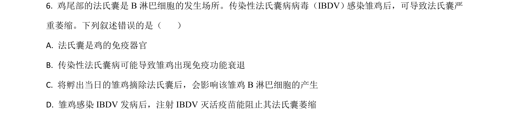
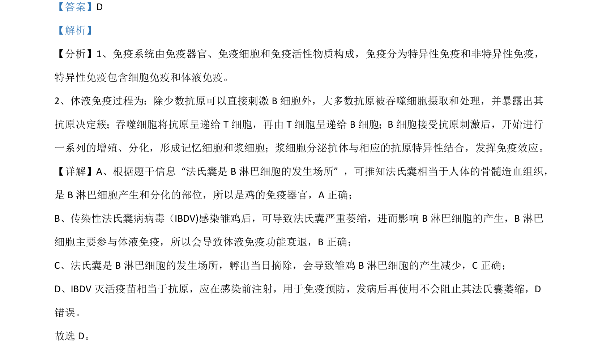

## 题面

## 摘要

本题通过鸡法氏囊考查免疫器官、B淋巴细胞及体液免疫功能

## 关联考点

- [[354-免疫器官|免疫器官]]
- [[B淋巴细胞]]
- [[353-体液免疫|体液免疫]]
- [[免疫预防]]

## 答案与解析

> 📄 原 PDF 第 5 页：`素材/真题/湖南/2008-2024·（湖南）生物高考真题/2021年高考生物试卷（湖南）（解析卷）.pdf`
