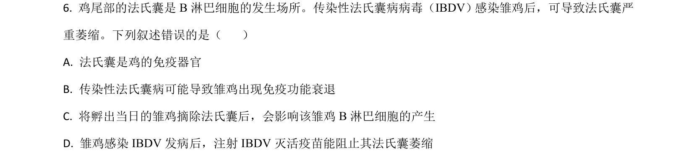
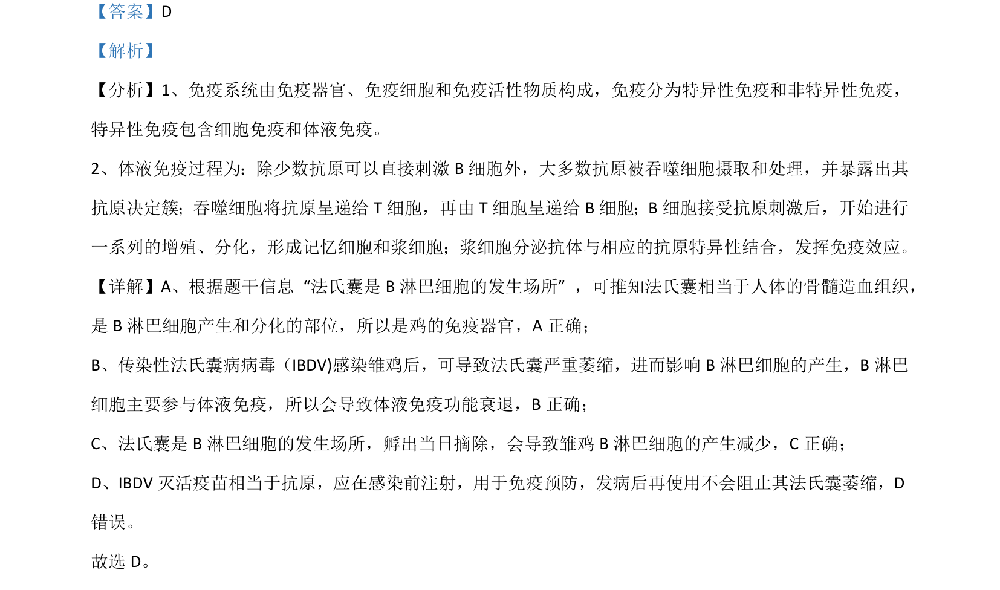

## 题面

## 摘要

本题通过鸡法氏囊考查免疫器官、B淋巴细胞及体液免疫功能

## 关联考点

- [[354-免疫器官|免疫器官]]
- [[B淋巴细胞]]
- [[353-体液免疫|体液免疫]]
- [[免疫预防]]

## 答案与解析

> 📄 原 PDF 第 5 页：`素材/真题/湖南/2008-2024·（湖南）生物高考真题/2021年高考生物试卷（湖南）（解析卷）.pdf`

<!-- 题干文本-start -->
## 题干文本
6. 鸡尾部的法氏囊是 B淋巴细胞的发生场所。传染性法氏囊病病毒（IBDV）感染雏鸡后，可导致法氏囊严
重萎缩。下列叙述错误的是（    ）
A. 法氏囊是鸡的免疫器官
B. 传染性法氏囊病可能导致雏鸡出现免疫功能衰退
C. 将孵出当日的雏鸡摘除法氏囊后，会影响该雏鸡 B淋巴细胞的产生
D. 雏鸡感染 IBDV 发病后，注射 IBDV 灭活疫苗能阻止其法氏囊萎缩
<!-- 题干文本-end -->

<!-- 解析文本-start -->
## 解析文本
【答案】D
【解析】
【分析】1、免疫系统由免疫器官、免疫细胞和免疫活性物质构成，免疫分为特异性免疫和非特异性免疫，
特异性免疫包含细胞免疫和体液免疫。
2、体液免疫过程为：除少数抗原可以直接刺激B细胞外，大多数抗原被吞噬细胞摄取和处理，并暴露出其
抗原决定簇；吞噬细胞将抗原呈递给T 细胞，再由 T 细胞呈递给 B细胞；B细胞接受抗原刺激后，开始进行
一系列的增殖、分化，形成记忆细胞和浆细胞；浆细胞分泌抗体与相应的抗原特异性结合，发挥免疫效应。
【详解】A、根据题干信息 “ 法氏囊是 B淋巴细胞的发生场所” ，可推知法氏囊相当于人体的骨髓造血组织，
是 B淋巴细胞产生和分化的部位，所以是鸡的免疫器官，A正确；
B、传染性法氏囊病病毒（IBDV)感染雏鸡后，可导致法氏囊严重萎缩，进而影响 B淋巴细胞的产生，B淋巴
细胞主要参与体液免疫，所以会导致体液免疫功能衰退，B正确；
C、法氏囊是 B淋巴细胞的发生场所，孵出当日摘除，会导致雏鸡 B淋巴细胞的产生减少，C 正确；
D、IBDV 灭活疫苗相当于抗原，应在感染前注射，用于免疫预防，发病后再使用不会阻止其法氏囊萎缩，D
错误。
故选 D。
<!-- 解析文本-end -->
