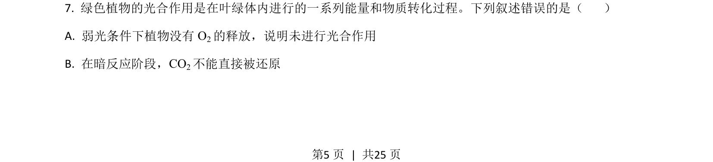
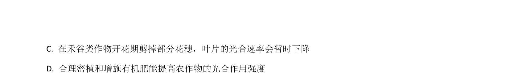
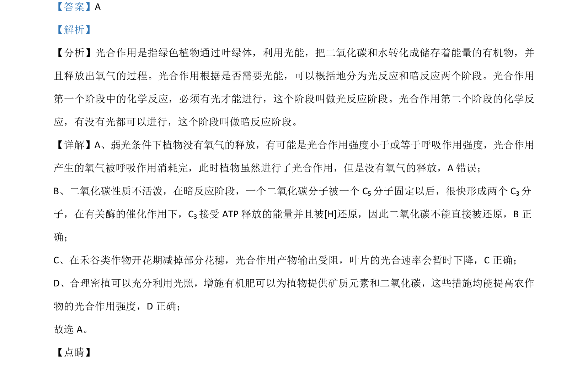

## 题面

## 摘要

考查光合作用的过程、影响因素及相关实验分析。

## 关联考点

- [[033-光合作用|光合作用]]
- [[236-光反应|光反应]]
- [[239-暗反应|暗反应]]
- [[241-细胞呼吸|细胞呼吸]]

## 答案与解析

> 📄 原 PDF 第 5 页：`素材/真题/湖南/2008-2024·（湖南）生物高考真题/2021年高考生物试卷（湖南）（解析卷）.pdf`
