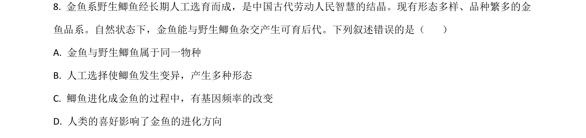
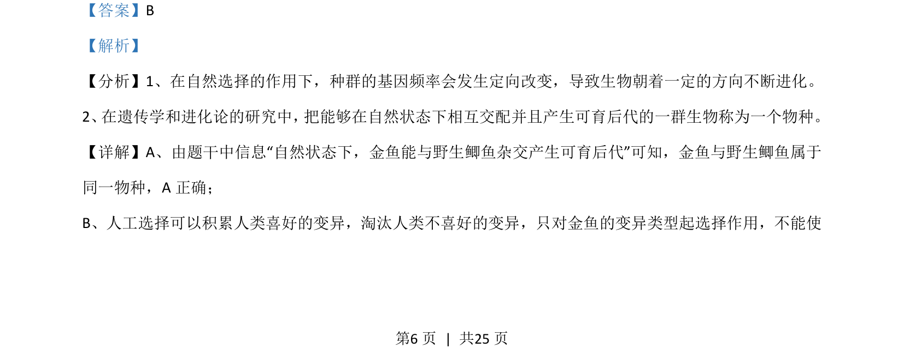
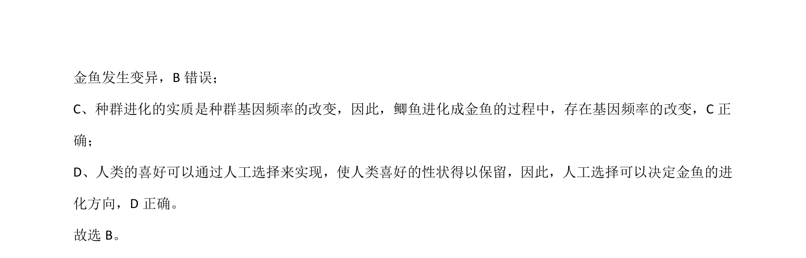

## 题面

## 摘要

该题考查金鱼与野生鲫鱼的物种关系及进化过程中的人工选择和基因频率变化。

## 关联考点

- [[390-species|物种]]
- [[803-基因频率|基因频率]]
- [[人工选择]]
- [[184-自然选择|自然选择]]

## 答案与解析

> 📄 原 PDF 第 6 页：`素材/真题/湖南/2008-2024·（湖南）生物高考真题/2021年高考生物试卷（湖南）（解析卷）.pdf`
