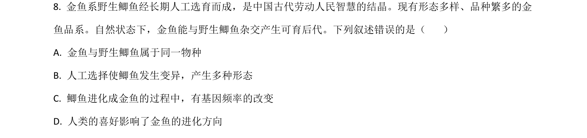
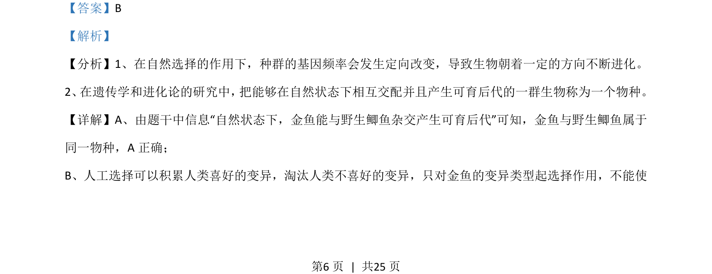
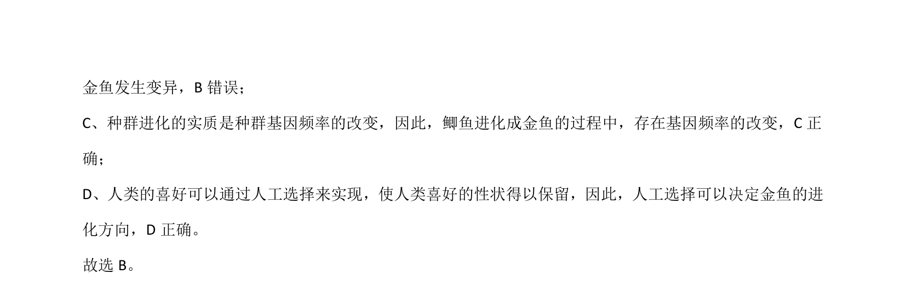

## 题面

## 摘要

该题考查金鱼与野生鲫鱼的物种关系及进化过程中的人工选择和基因频率变化。

## 关联考点

- [[390-species|物种]]
- [[803-基因频率|基因频率]]
- [[人工选择]]
- [[184-自然选择|自然选择]]

## 答案与解析

> 📄 原 PDF 第 6 页：`素材/真题/湖南/2008-2024·（湖南）生物高考真题/2021年高考生物试卷（湖南）（解析卷）.pdf`

<!-- 题干文本-start -->
## 题干文本
8. 金鱼系野生鲫鱼经长期人工选育而成，是中国古代劳动人民智慧的结晶。现有形态多样、品种繁多的金
鱼品系。自然状态下，金鱼能与野生鲫鱼杂交产生可育后代。下列叙述错误的是（    ）
A. 金鱼与野生鲫鱼属于同一物种
B. 人工选择使鲫鱼发生变异，产生多种形态
C. 鲫鱼进化成金鱼的过程中，有基因频率的改变
D. 人类的喜好影响了金鱼的进化方向
<!-- 题干文本-end -->

<!-- 解析文本-start -->
## 解析文本
【答案】B
【解析】
【分析】1、在自然选择的作用下，种群的基因频率会发生定向改变，导致生物朝着一定的方向不断进化。
2、 在遗传学和进化论的研究中， 把能够在自然状态下相互交配并且产生可育后代的一群生物称为一个物种。
【详解】A、由题干中信息“自然状态下，金鱼能与野生鲫鱼杂交产生可育后代”可知，金鱼与野生鲫鱼属于
同一物种，A正确；
B、人工选择可以积累人类喜好的变异，淘汰人类不喜好的变异，只对金鱼的变异类型起选择作用，不能使
<!-- 解析文本-end -->
