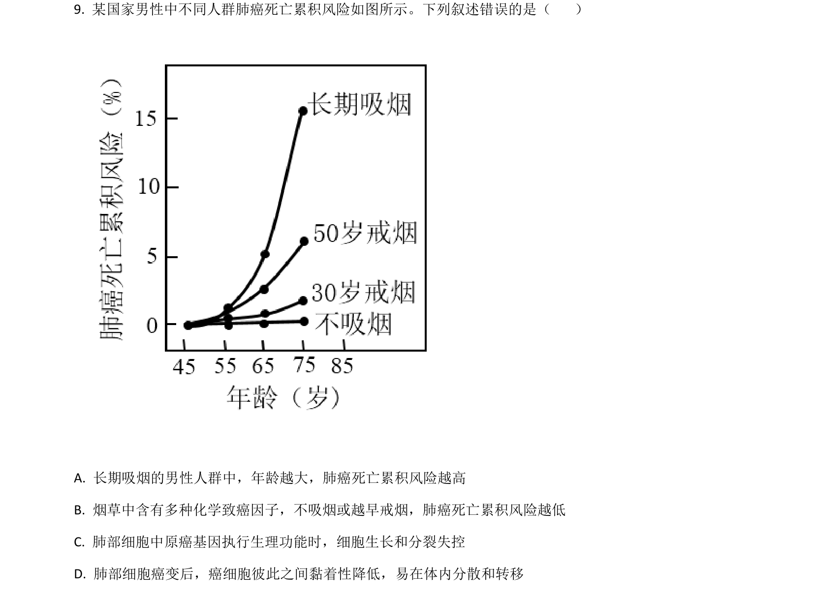
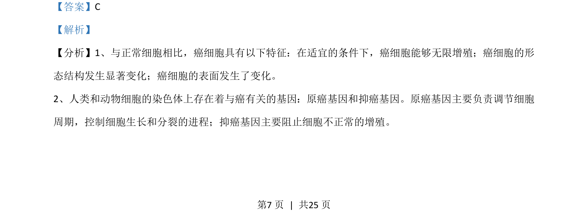
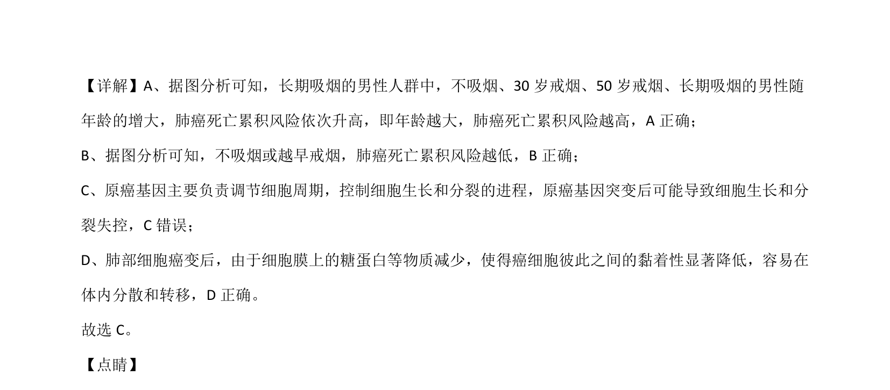

## 题面

## 摘要

考查癌细胞特征、原癌基因与抑癌基因功能及伴性遗传病分析

## 关联考点

- [[815-癌细胞特征|癌细胞特征]]
- [[928-原癌基因与抑癌基因|原癌基因与抑癌基因]]
- [[276-伴性遗传|伴性遗传]]

## 答案与解析

> 📄 原 PDF 第 7 页：`素材/真题/湖南/2008-2024·（湖南）生物高考真题/2021年高考生物试卷（湖南）（解析卷）.pdf`

<!-- 题干文本-start -->
## 题干文本
9. 某国家男性中不同人群肺癌死亡累积风险如图所示。下列叙述错误的是（    ）
A. 长期吸烟的男性人群中，年龄越大，肺癌死亡累积风险越高
B. 烟草中含有多种化学致癌因子，不吸烟或越早戒烟，肺癌死亡累积风险越低
C. 肺部细胞中原癌基因执行生理功能时，细胞生长和分裂失控
D. 肺部细胞癌变后，癌细胞彼此之间黏着性降低，易在体内分散和转移
<!-- 题干文本-end -->

<!-- 解析文本-start -->
## 解析文本
【答案】C
【解析】
【分析】1、与正常细胞相比，癌细胞具有以下特征：在适宜的条件下，癌细胞能够无限增殖；癌细胞的形
态结构发生显著变化；癌细胞的表面发生了变化。
2、人类和动物细胞的染色体上存在着与癌有关的基因：原癌基因和抑癌基因。原癌基因主要负责调节细胞
周期，控制细胞生长和分裂的进程；抑癌基因主要阻止细胞不正常的增殖。
<!-- 解析文本-end -->
