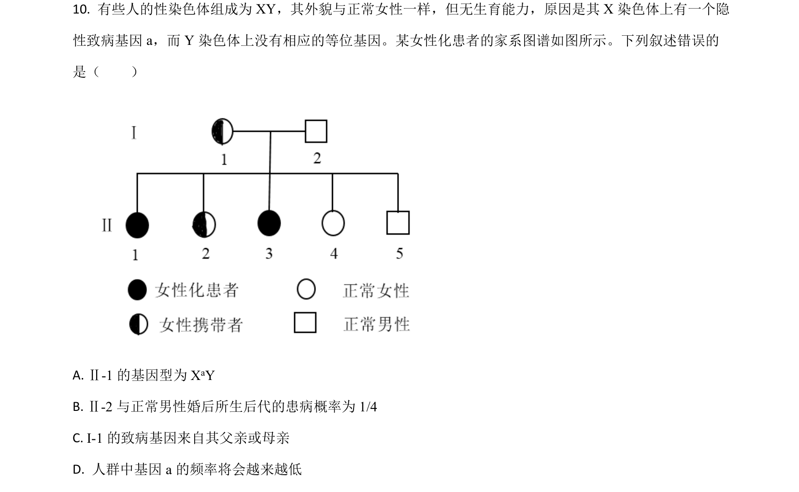
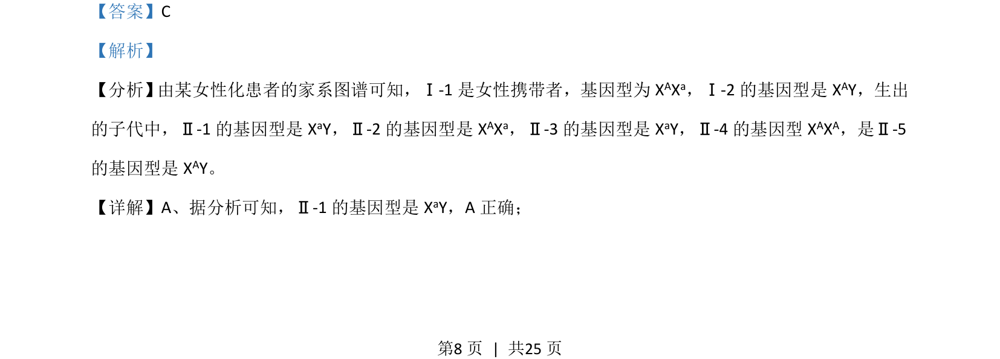
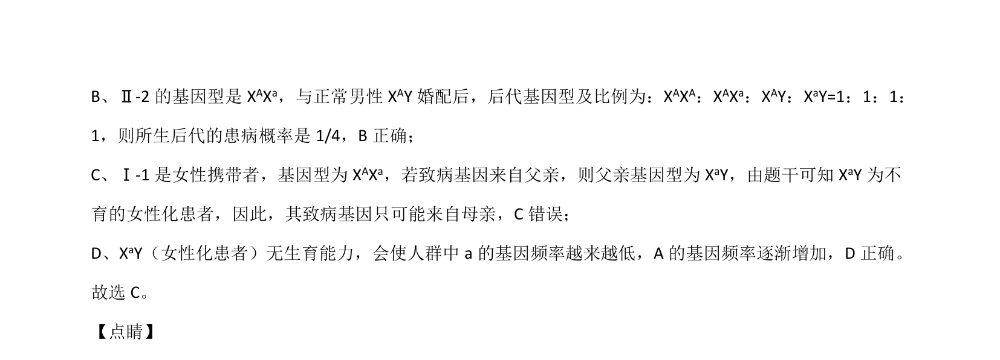

## 题面

## 摘要

该题通过女性化患者家系图谱考查伴X隐性遗传的基因型推断、概率计算及基因频率变化。

## 关联考点

- [[802-伴X隐性遗传|伴X隐性遗传]]
- [[516-遗传系谱图分析|遗传系谱图分析]]
- [[803-基因频率|基因频率]]
- [[基因型推断与概率]]

## 答案与解析

> 📄 原 PDF 第 8 页：`素材/真题/湖南/2008-2024·（湖南）生物高考真题/2021年高考生物试卷（湖南）（解析卷）.pdf`
