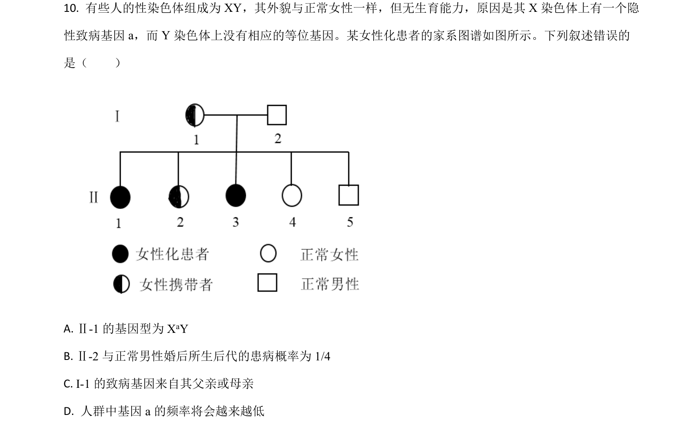
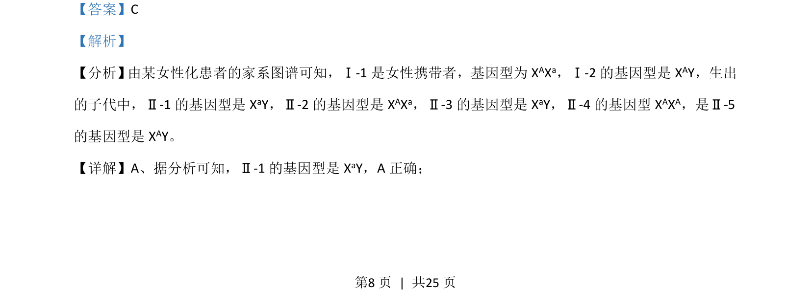
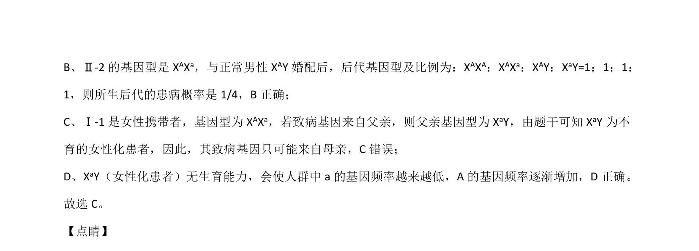

## 题面

## 摘要

该题通过女性化患者家系图谱考查伴X隐性遗传的基因型推断、概率计算及基因频率变化。

## 关联考点

- [[802-伴X隐性遗传|伴X隐性遗传]]
- [[516-遗传系谱图分析|遗传系谱图分析]]
- [[803-基因频率|基因频率]]
- [[基因型推断与概率]]

## 答案与解析

> 📄 原 PDF 第 8 页：`素材/真题/湖南/2008-2024·（湖南）生物高考真题/2021年高考生物试卷（湖南）（解析卷）.pdf`

<!-- 题干文本-start -->
## 题干文本
10. 有些人的性染色体组成为 XY，其外貌与正常女性一样，但无生育能力，原因是其 X 染色体上有一个隐
性致病基因 a，而 Y 染色体上没有相应的等位基因。某女性化患者的家系图谱如图所示。下列叙述错误的
是（     ）
A. Ⅱ-1 的基因型为 XaY
B. Ⅱ-2 与正常男性婚后所生后代的患病概率为 1/4
C. I-1的致病基因来自其父亲或母亲
D. 人群中基因 a的频率将会越来越低
<!-- 题干文本-end -->

<!-- 解析文本-start -->
## 解析文本
【答案】C
【解析】
【分析】 由某女性化患者的家系图谱可知，Ⅰ-1是女性携带者，基因型为 XAXa，Ⅰ-2的基因型是 XAY，生出
的子代中，Ⅱ-1的基因型是 XaY，Ⅱ-2的基因型是 XAXa，Ⅱ-3的基因型是 XaY，Ⅱ-4的基因型 XAXA，是Ⅱ-5
的基因型是 XAY。
【详解】A、据分析可知，Ⅱ-1的基因型是 XaY，A正确；
<!-- 解析文本-end -->
