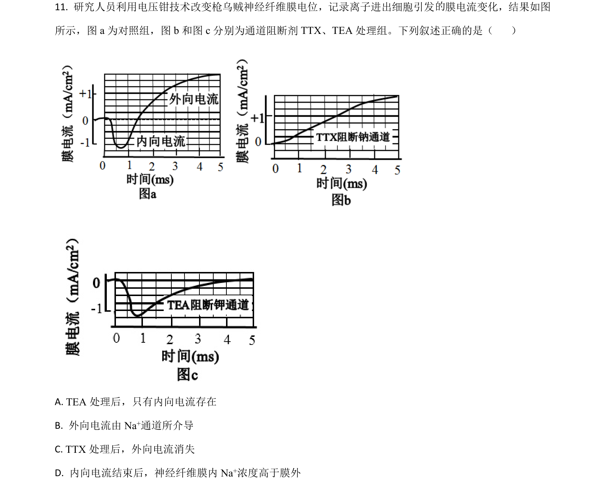
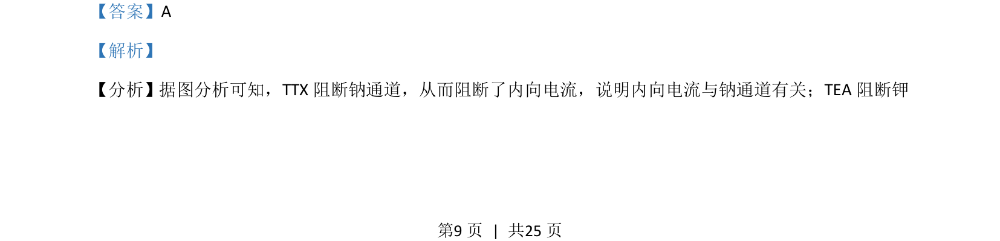
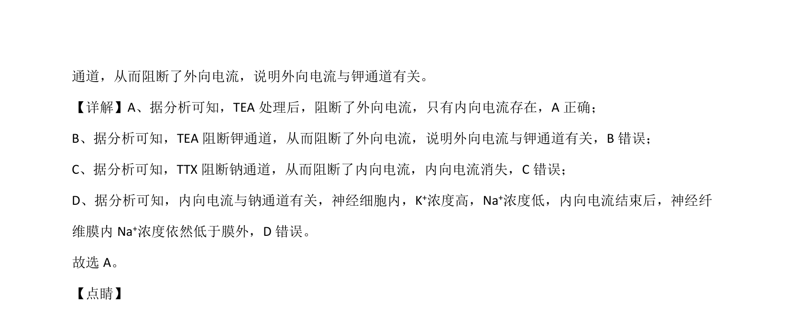

## 题面

## 摘要

考查细胞呼吸原理在农业生产和食品保存中的应用。

## 关联考点

- [[细胞呼吸原理]]
- [[015-种子萌发|种子萌发]]
- [[种子贮藏]]
- [[果蔬保鲜]]

## 答案与解析

> 📄 原 PDF 第 9 页：`素材/真题/湖南/2008-2024·（湖南）生物高考真题/2021年高考生物试卷（湖南）（解析卷）.pdf`

<!-- 题干文本-start -->
## 题干文本
11. 研究人员利用电压钳技术改变枪乌贼神经纤维膜电位，记录离子进出细胞引发 膜电流变化，结果如图
所示，图 a为对照组，图 b 和图 c分别为通道阻断剂 TTX、TEA处理组。下列叙述正确的是（    ）
A. TEA处理后，只有内向电流存在
B. 外向电流由 Na+通道所介导
C. TTX处理后，外向电流消失
D. 内向电流结束后，神经纤维膜内 Na+浓度高于膜外
<!-- 题干文本-end -->

<!-- 解析文本-start -->
## 解析文本
【答案】A
【解析】
【分析】 据图分析可知，TTX 阻断钠通道，从而阻断了内向电流，说明内向电流与钠通道有关；TEA 阻断钾
的
<!-- 解析文本-end -->
