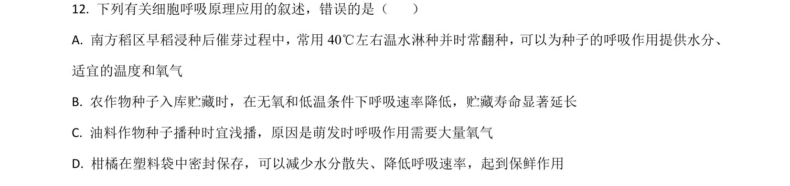
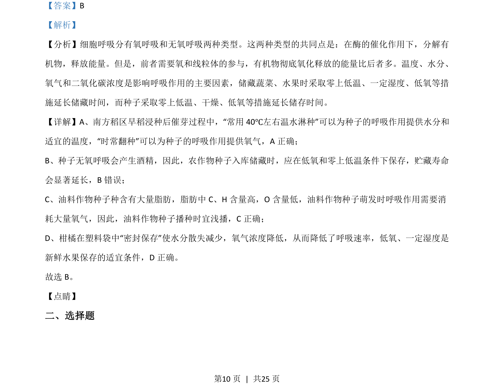

## 题面

## 摘要

考查细胞呼吸类型、影响因素及在种子萌发与储藏中的应用

## 关联考点

- [[240-有氧呼吸|有氧呼吸]]
- [[238-无氧呼吸|无氧呼吸]]
- [[细胞呼吸影响因素]]
- [[储藏条件]]

## 答案与解析

> 📄 原 PDF 第 10 页：`素材/真题/湖南/2008-2024·（湖南）生物高考真题/2021年高考生物试卷（湖南）（解析卷）.pdf`
