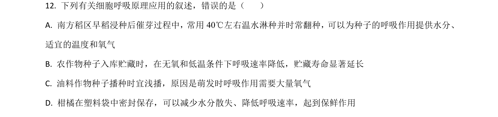
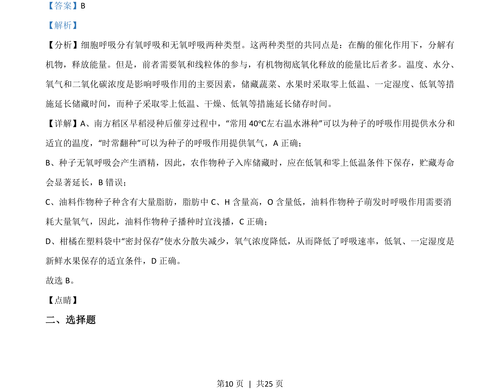

## 题面

## 摘要

考查细胞呼吸类型、影响因素及在种子萌发与储藏中的应用

## 关联考点

- [[240-有氧呼吸|有氧呼吸]]
- [[238-无氧呼吸|无氧呼吸]]
- [[细胞呼吸影响因素]]
- [[储藏条件]]

## 答案与解析

> 📄 原 PDF 第 10 页：`素材/真题/湖南/2008-2024·（湖南）生物高考真题/2021年高考生物试卷（湖南）（解析卷）.pdf`

<!-- 题干文本-start -->
## 题干文本
12. 下列有关细胞呼吸原理应用的叙述，错误的是（    ）
A. 南方稻区早稻浸种后催芽过程中，常用40℃左右温水淋种并时常翻种，可以为种子的呼吸作用提供水分、
适宜的温度和氧气
B. 农作物种子入库贮藏时，在无氧和低温条件下呼吸速率降低，贮藏寿命显著延长
C. 油料作物种子播种时宜浅播，原因是萌发时呼吸作用需要大量氧气
D. 柑橘在塑料袋中密封保存，可以减少水分散失、降低呼吸速率，起到保鲜作用
<!-- 题干文本-end -->

<!-- 解析文本-start -->
## 解析文本
【答案】B
【解析】
【分析】细胞呼吸分有氧呼吸和无氧呼吸两种类型。这两种类型的共同点是：在酶的催化作用下，分解有
机物，释放能量。但是，前者需要氧和线粒体的参与，有机物彻底氧化释放的能量比后者多。温度、水分、
氧气和二氧化碳浓度是影响呼吸作用的主要因素，储藏蔬菜、水果时采取零上低温、一定湿度、低氧等措
施延长储藏时间，而种子采取零上低温、干燥、低氧等措施延长储存时间。
【详解】A、南方稻区早稻浸种后催芽过程中，“常用 40℃左右温水淋种”可以为种子的呼吸作用提供水分和
适宜的温度，“时常翻种”可以为种子的呼吸作用提供氧气，A正确；
B、种子无氧呼吸会产生酒精，因此，农作物种子入库储藏时，应在低氧和零上低温条件下保存，贮藏寿命
会显著延长，B错误；
C、油料作物种子种含有大量脂肪，脂肪中 C、H 含量高，O 含量低，油料作物种子萌发时呼吸作用需要消
耗大量氧气，因此，油料作物种子播种时宜浅播，C 正确；
D、柑橘在塑料袋中“密封保存”使水分散失减少，氧气浓度降低，从而降低了呼吸速率，低氧、一定湿度是
新鲜水果保存的适宜条件，D 正确。
故选 B。
【点睛】
二、选择题
<!-- 解析文本-end -->
