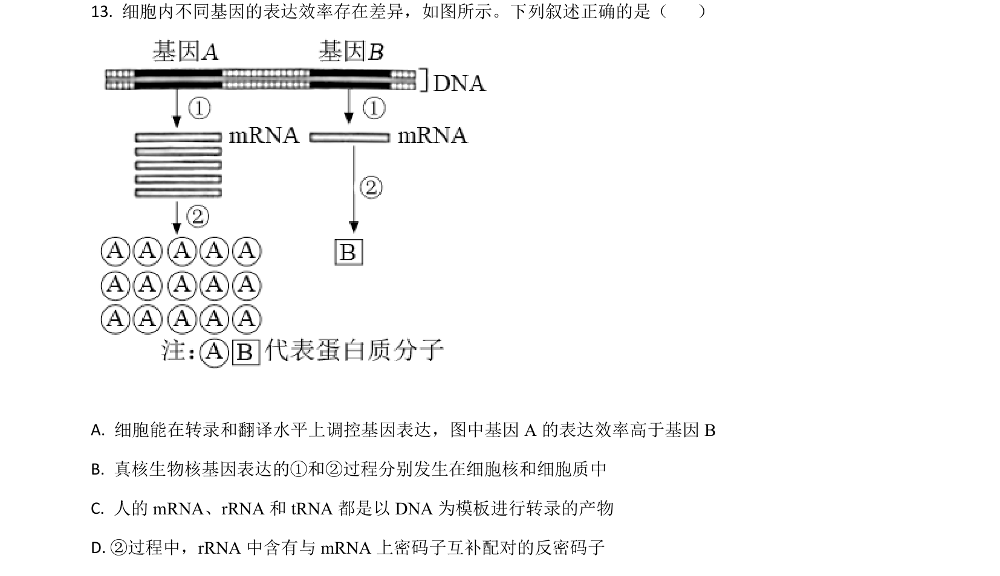
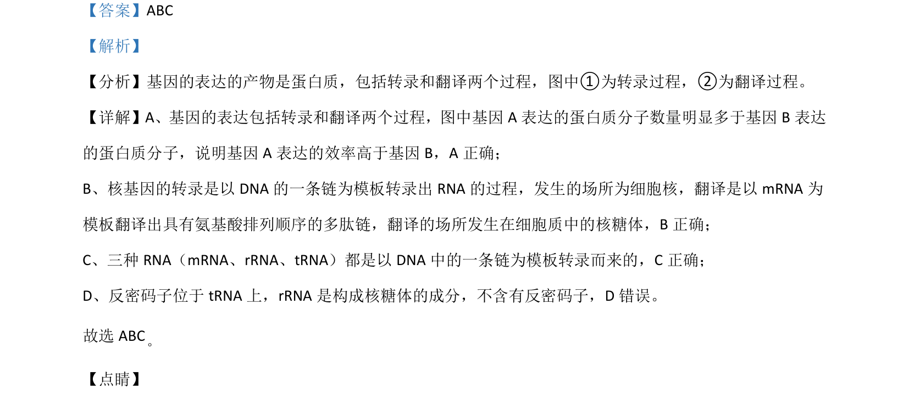

## 题面

## 摘要

基因表达过程及RNA种类和功能辨析

## 关联考点

- [[479-基因表达|基因表达]]
- [[298-转录|转录]]
- [[466-interpret|翻译]]
- [[464-RNA|RNA]]

## 答案与解析

> 📄 原 PDF 第 11 页：`素材/真题/湖南/2008-2024·（湖南）生物高考真题/2021年高考生物试卷（湖南）（解析卷）.pdf`
