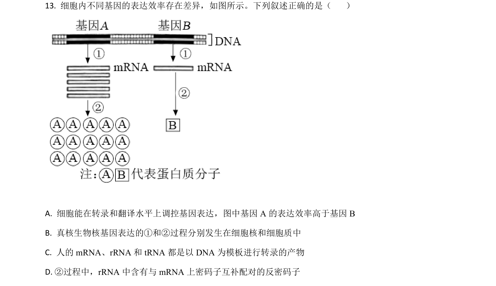
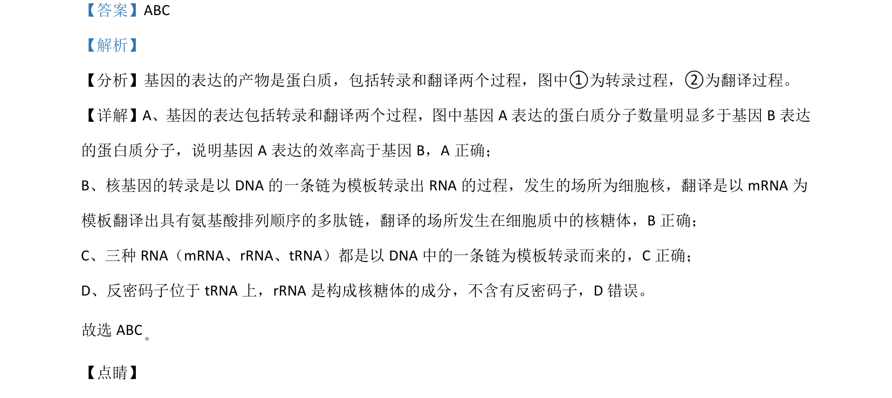

## 题面

## 摘要

基因表达过程及RNA种类和功能辨析

## 关联考点

- [[843-基因的表达|基因表达]]
- [[298-转录|转录]]
- [[466-interpret|翻译]]
- [[464-RNA|RNA]]

## 答案与解析

> 📄 原 PDF 第 11 页：`素材/真题/湖南/2008-2024·（湖南）生物高考真题/2021年高考生物试卷（湖南）（解析卷）.pdf`

<!-- 题干文本-start -->
## 题干文本
13. 细胞内不同基因的表达效率存在差异，如图所示。下列叙述正确的是（    ）
A. 细胞能在转录和翻译水平上调控基因表达，图中基因 A 的表达效率高于基因 B
B. 真核生物核基因表达的①和②过程分别发生在细胞核和细胞质中
C. 人的 mRNA、rRNA 和 tRNA 都是以 DNA 为模板进行转录的产物
D. ②过程中，rRNA 中含有与 mRNA 上密码子互补配对的反密码子
<!-- 题干文本-end -->

<!-- 解析文本-start -->
## 解析文本
【答案】ABC
【解析】
【分析】基因的表达的产物是蛋白质，包括转录和翻译两个过程，图中①为转录过程，②为翻译过程。
【详解】A、基因的表达包括转录和翻译两个过程，图中基因A表达的蛋白质分子数量明显多于基因 B表达
的蛋白质分子，说明基因 A表达的效率高于基因 B，A正确；
B、核基因的转录是以 DNA的一条链为模板转录出 RNA的过程，发生的场所为细胞核，翻译是以 mRNA为
模板翻译出具有氨基酸排列顺序的多肽链，翻译的场所发生在细胞质中的核糖体，B正确；
C、三种 RNA（mRNA、rRNA、tRNA）都是以 DNA中的一条链为模板转录而来的，C 正确；
D、反密码子位于 tRNA上，rRNA是构成核糖体的成分，不含有反密码子，D 错误。
故选 ABC
【点睛】
<!-- 解析文本-end -->
