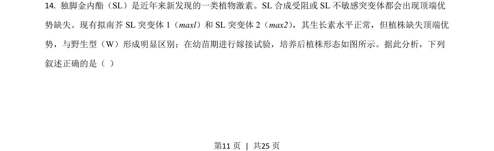
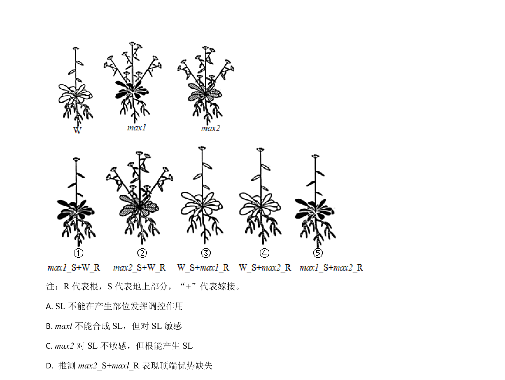
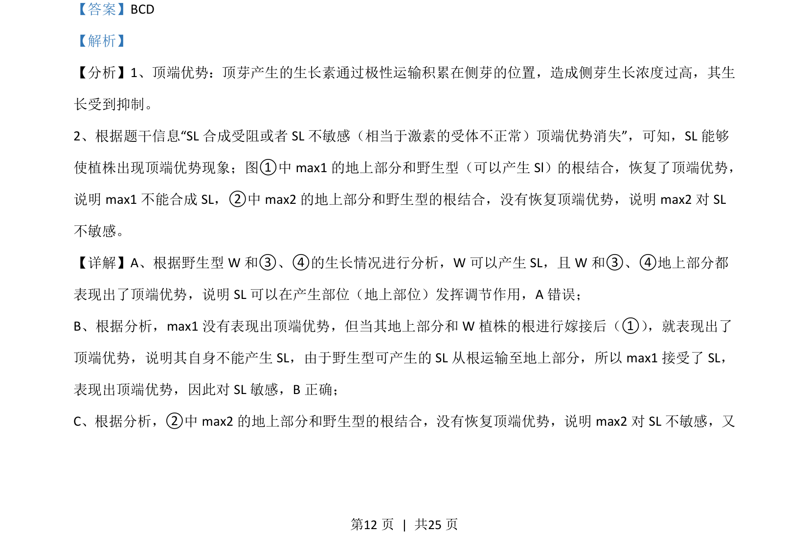
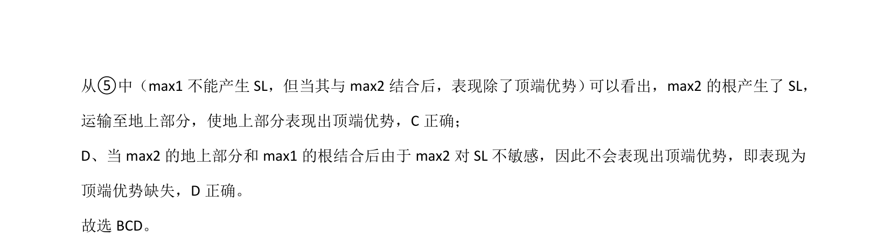

## 题面

## 摘要

该题通过嫁接实验分析SL（类激素）在顶端优势中的作用及突变体敏感性，考查信息获取与推理能力。

## 关联考点

- [[352-顶端优势|顶端优势]]
- [[347-生长素|生长素]]
- [[SL]]
- [[915-嫁接实验|嫁接实验]]

## 答案与解析

> 📄 原 PDF 第 11 页：`素材/真题/湖南/2008-2024·（湖南）生物高考真题/2021年高考生物试卷（湖南）（解析卷）.pdf`
