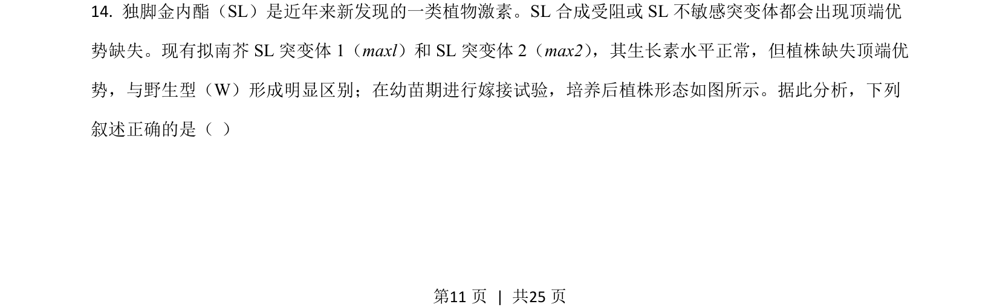
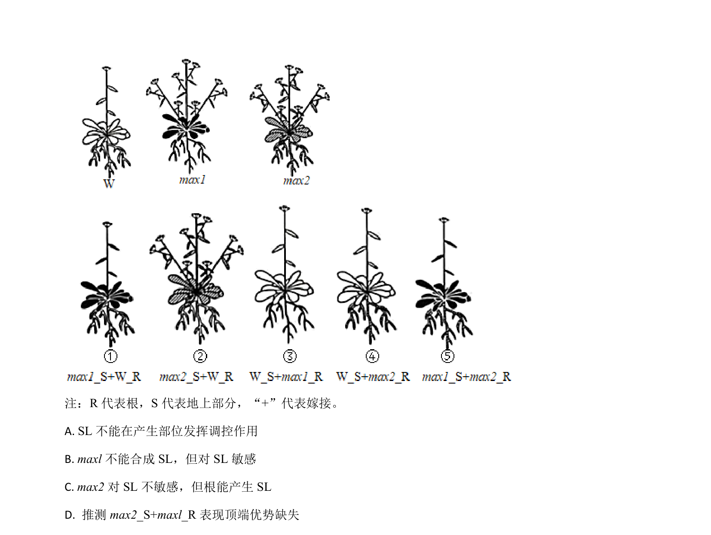
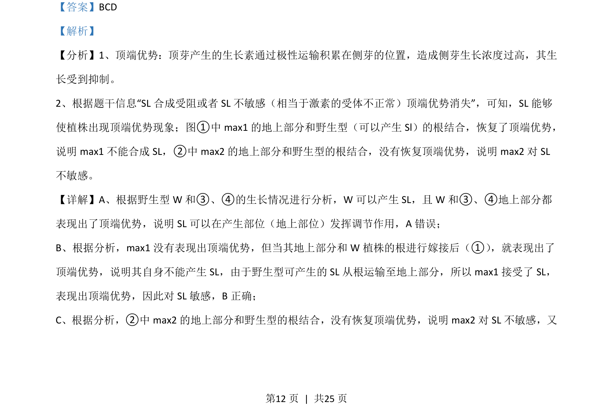
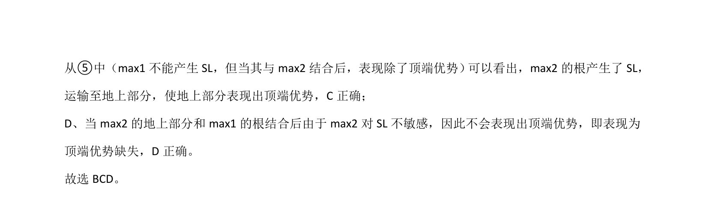

## 题面

## 摘要

该题通过嫁接实验分析SL（类激素）在顶端优势中的作用及突变体敏感性，考查信息获取与推理能力。

## 关联考点

- [[352-顶端优势|顶端优势]]
- [[347-生长素|生长素]]
- [[SL]]
- [[915-嫁接实验|嫁接实验]]

## 答案与解析

> 📄 原 PDF 第 11 页：`素材/真题/湖南/2008-2024·（湖南）生物高考真题/2021年高考生物试卷（湖南）（解析卷）.pdf`

<!-- 题干文本-start -->
## 题干文本
14. 独脚金内酯（SL）是近年来新发现的一类植物激素。SL合成受阻或 SL不敏感突变体都会出现顶端优
势缺失。现有拟南芥 SL突变体 1（maxl）和 SL突变体 2（max2） ，其生长素水平正常，但植株缺失顶端优
势，与野生型（W）形成明显区别；在幼苗期进行嫁接试验，培养后植株形态如图所示。据此分析，下列
叙述正确的是（ ）
。
<!-- 题干文本-end -->

<!-- 解析文本-start -->
## 解析文本

<!-- 解析文本-end -->
