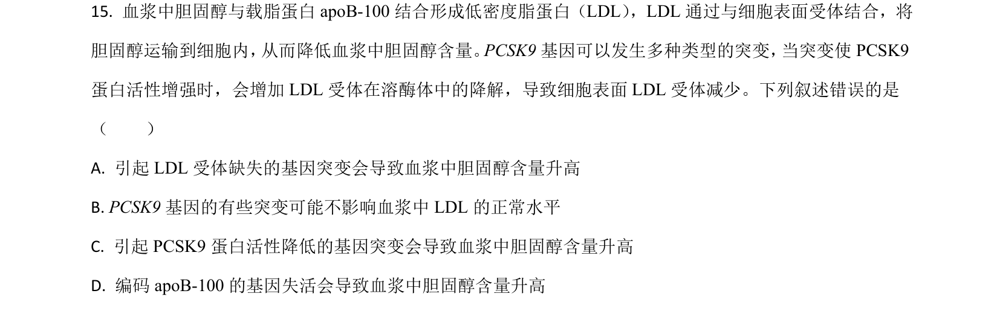
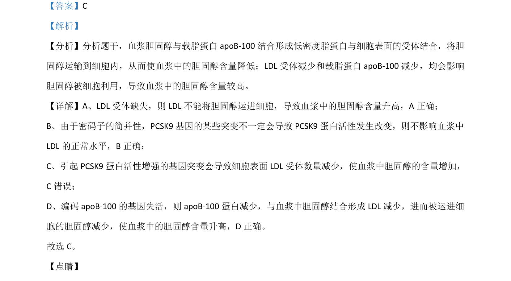

## 题面

## 摘要

本题考查血浆胆固醇与LDL受体、载脂蛋白及基因突变对胆固醇代谢的影响。

## 关联考点

- [[血浆胆固醇]]
- [[LDL受体]]
- [[载脂蛋白]]
- [[301-基因突变|基因突变]]

## 答案与解析

> 📄 原 PDF 第 13 页：`素材/真题/湖南/2008-2024·（湖南）生物高考真题/2021年高考生物试卷（湖南）（解析卷）.pdf`
