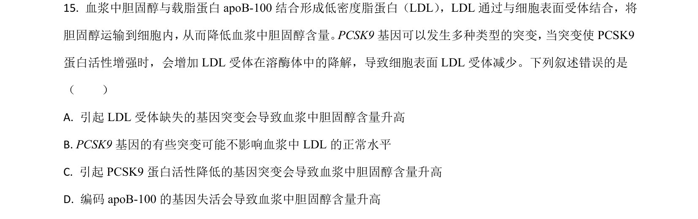
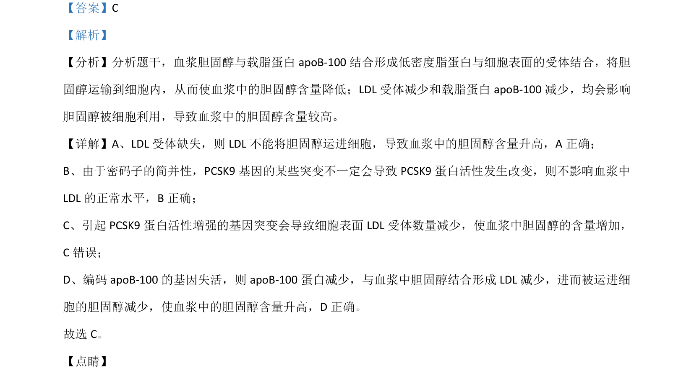

## 题面

## 摘要

本题考查血浆胆固醇与LDL受体、载脂蛋白及基因突变对胆固醇代谢的影响。

## 关联考点

- [[血浆胆固醇]]
- [[LDL受体]]
- [[载脂蛋白]]
- [[301-基因突变|基因突变]]

## 答案与解析

> 📄 原 PDF 第 13 页：`素材/真题/湖南/2008-2024·（湖南）生物高考真题/2021年高考生物试卷（湖南）（解析卷）.pdf`

<!-- 题干文本-start -->
## 题干文本
15. 血浆中胆固醇与载脂蛋白 apoB-100结合形成低密度脂蛋白（LDL） ，LDL通过与细胞表面受体结合，将
胆固醇运输到细胞内， 从而降低血浆中胆固醇含量。PCSK9基因可以发生多种类型的突变， 当突变使PCSK9
蛋白活性增强时，会增加 LDL受体在溶酶体中的降解，导致细胞表面 LDL受体减少。下列叙述错误的是
（     ）
A. 引起 LDL受体缺失的基因突变会导致血浆中胆固醇含量升高
B. PCSK9基因的有些突变可能不影响血浆中 LDL的正常水平
C. 引起 PCSK9 蛋白活性降低的基因突变会导致血浆中胆固醇含量升高
D. 编码 apoB-100的基因失活会导致血浆中胆固醇含量升高
<!-- 题干文本-end -->

<!-- 解析文本-start -->
## 解析文本
【答案】C
【解析】
【分析】分析题干，血浆胆固醇与载脂蛋白 apoB-100 结合形成低密度脂蛋白与细胞表面的受体结合，将胆
固醇运输到细胞内，从而使血浆中的胆固醇含量降低； LDL 受体减少和载脂蛋白 apoB-100 减少，均会影响
胆固醇被细胞利用，导致血浆中的胆固醇含量较高。
【详解】A、LDL 受体缺失，则 LDL 不能将胆固醇运进细胞，导致血浆中的胆固醇含量升高，A正确；
B、由于密码子的简并性，PCSK9基因的某些突变不一定会导致 PCSK9蛋白活性发生改变，则不影响血浆中
LDL 的正常水平，B正确；
C、引起 PCSK9蛋白活性增强的基因突变会导致细胞表面 LDL 受体数量减少，使血浆中胆固醇的含量增加，
C 错误；
D、编码 apoB-100 的基因失活，则 apoB-100 蛋白减少，与血浆中胆固醇结合形成 LDL 减少，进而被运进细
胞的胆固醇减少，使血浆中的胆固醇含量升高，D 正确。
故选 C。
【点睛】
<!-- 解析文本-end -->
