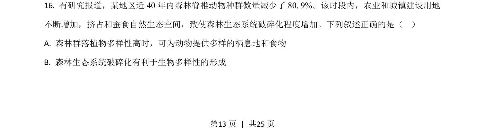
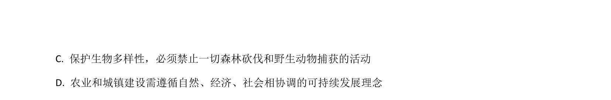
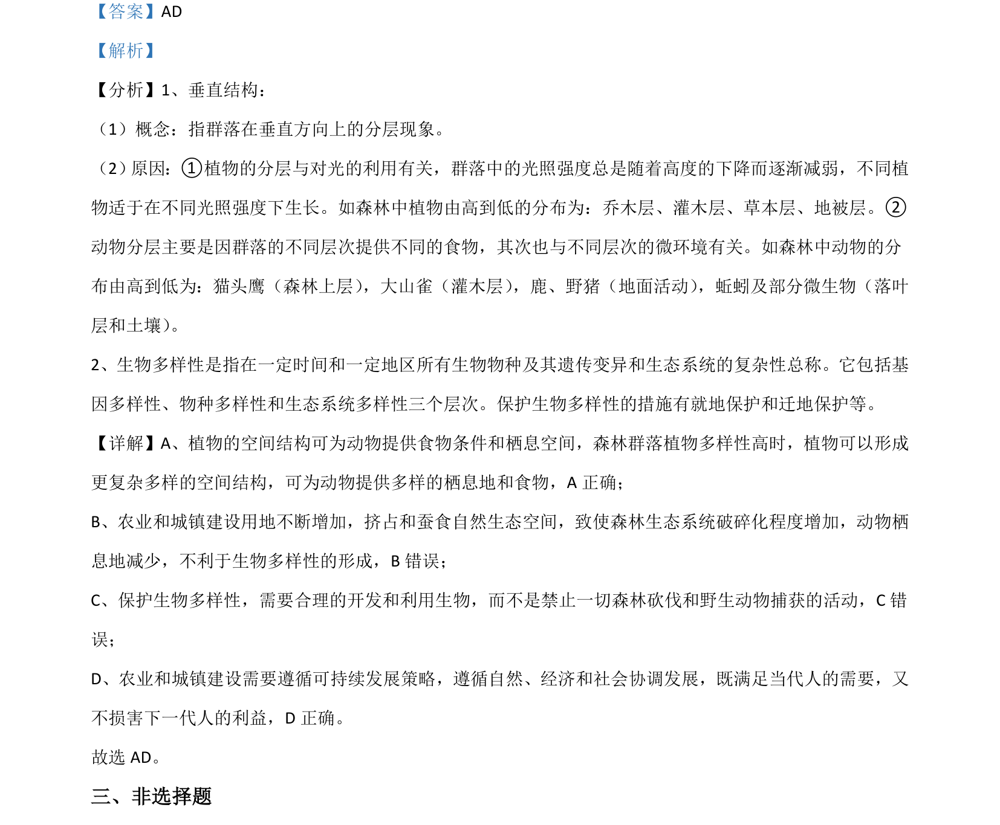

## 题面

## 摘要

考查群落垂直结构与生物多样性保护，以及油菜株高遗传机制与自由组合定律的应用。

## 关联考点

- [[375-群落垂直结构|群落垂直结构]]
- [[144-生物多样性|生物多样性]]
- [[580-基因自由组合定律|基因自由组合定律]]
- [[遗传机制]]

## 答案与解析

> 📄 原 PDF 第 13 页：`素材/真题/湖南/2008-2024·（湖南）生物高考真题/2021年高考生物试卷（湖南）（解析卷）.pdf`
