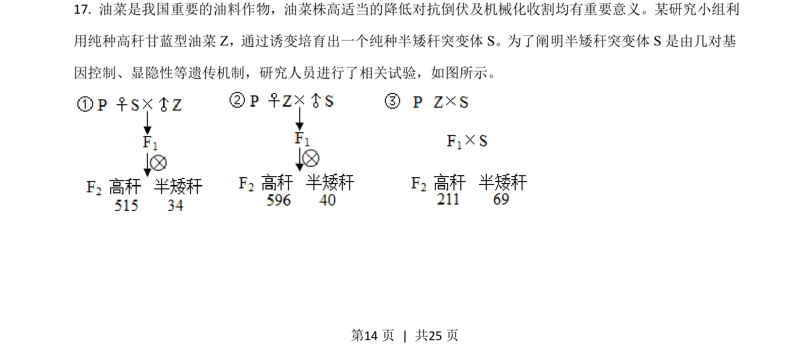
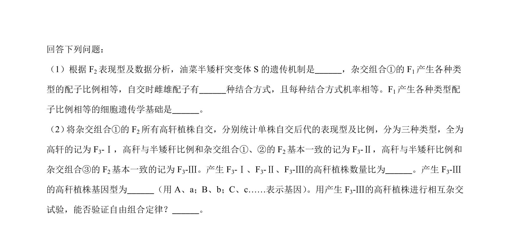
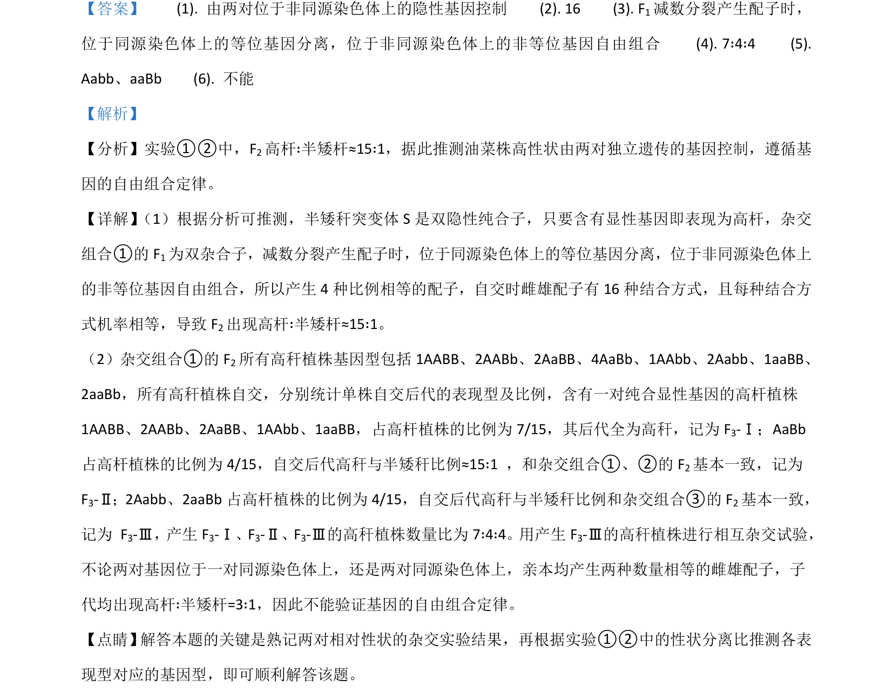

## 题面

## 摘要

1异常性状分离比的分析与验证。

## 关联考点

- [[272-自由组合定律|基因的自由组合定律]]
- [[601-性状分离比|性状分离比]]
- [[双隐性纯合子]]
- [[271-自交|自交]]

## 答案与解析

> 📄 原 PDF 第 14 页：`素材/真题/湖南/2008-2024·（湖南）生物高考真题/2021年高考生物试卷（湖南）（解析卷）.pdf`
