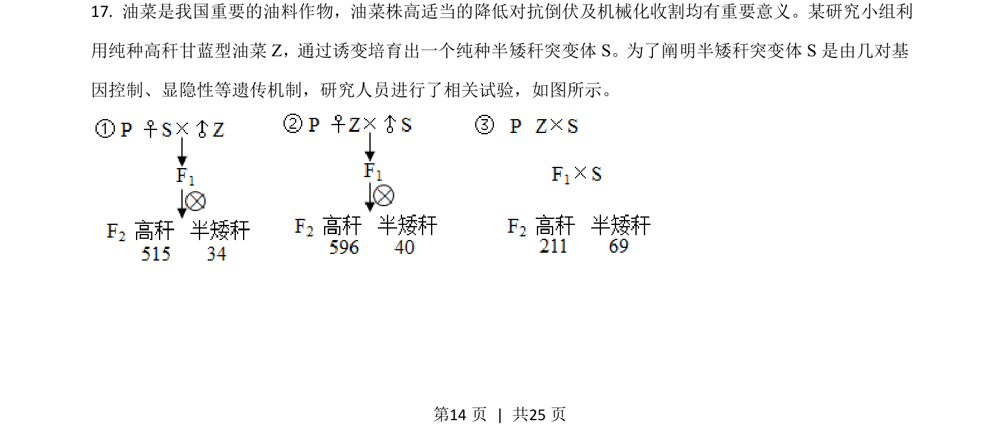
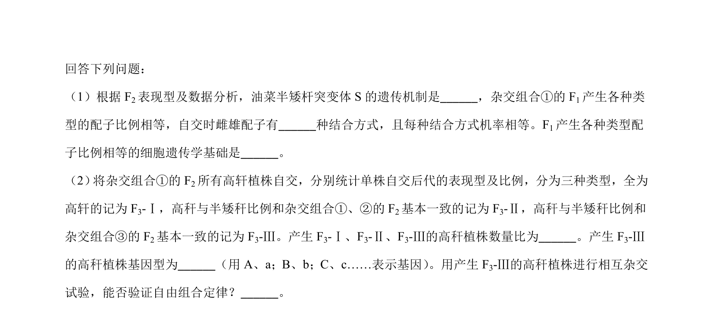
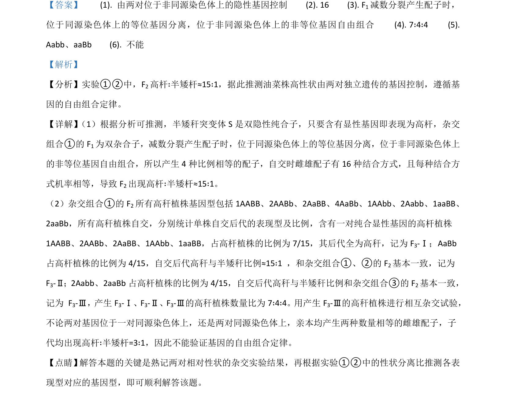

## 题面

## 摘要

1异常性状分离比的分析与验证。

## 关联考点

- [[272-自由组合定律|基因的自由组合定律]]
- [[601-性状分离比|性状分离比]]
- [[双隐性纯合子]]
- [[271-自交|自交]]

## 答案与解析

> 📄 原 PDF 第 14 页：`素材/真题/湖南/2008-2024·（湖南）生物高考真题/2021年高考生物试卷（湖南）（解析卷）.pdf`

<!-- 题干文本-start -->
## 题干文本
17. 油菜是我国重要的油料作物，油菜株高适当的降低对抗倒伏及机械化收割均有重要意义。某研究小组利
用纯种高秆甘蓝型油菜 Z，通过诱变培育出一个纯种半矮秆突变体S。为了阐明半矮秆突变体S 是由几对基
因控制、显隐性等遗传机制，研究人员进行了相关试验，如图所示。
<!-- 题干文本-end -->

<!-- 解析文本-start -->
## 解析文本

<!-- 解析文本-end -->
