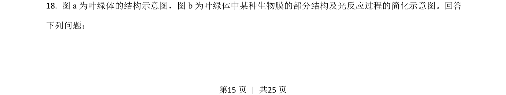
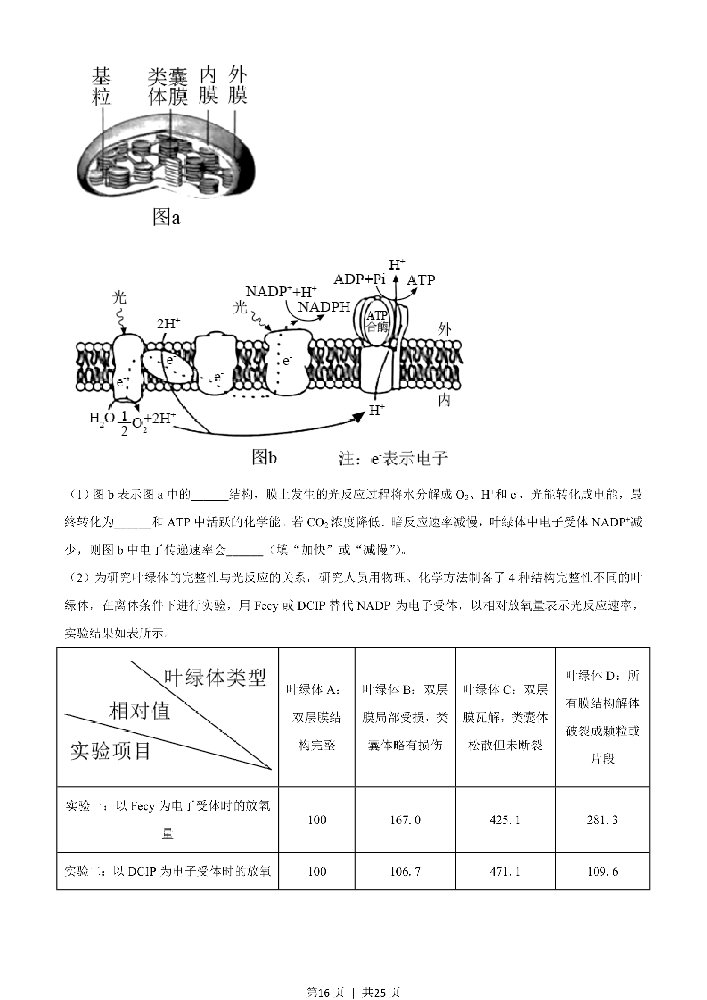
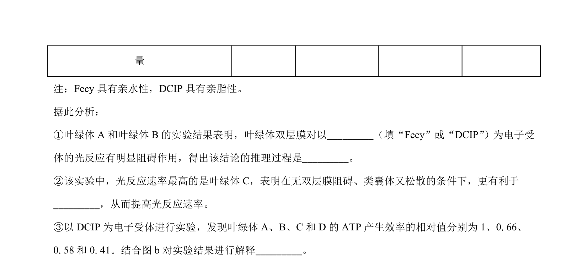
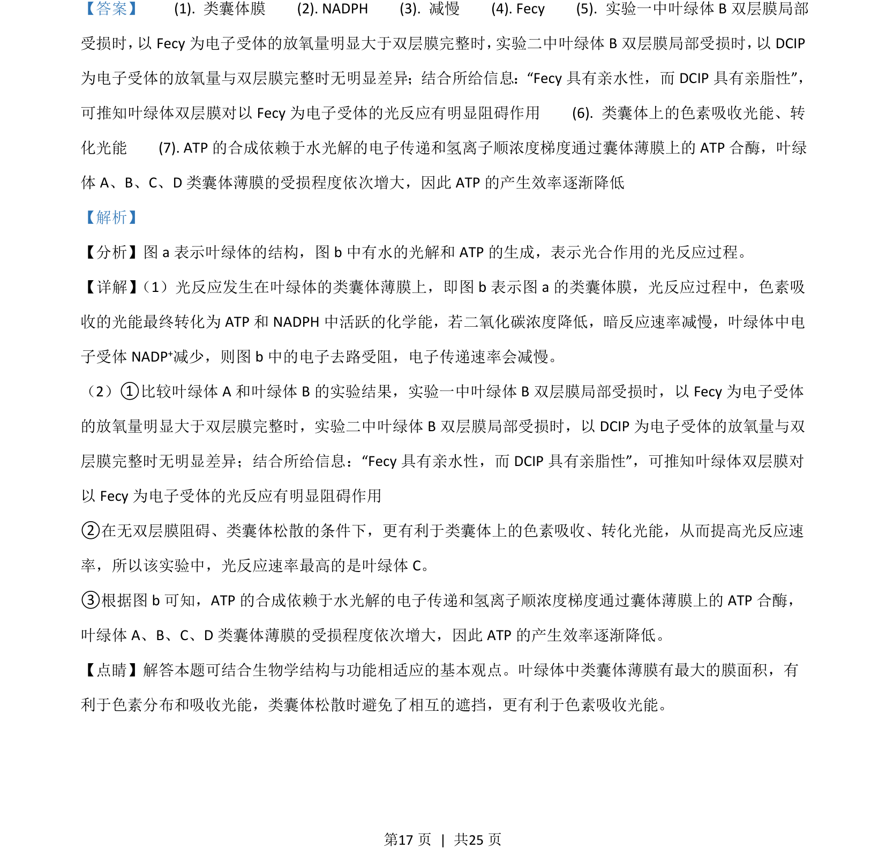

## 题面

## 摘要

本题通过叶绿体结构光反应实验及生长激素调节软骨细胞生长实验，考查光反应过程与影响因素及激素调节机制。

## 关联考点

- [[236-光反应|光反应]]
- [[类囊体薄膜]]
- [[电子传递]]
- [[生长激素受体]]
- [[909-负反馈调节|负反馈调节]]

## 答案与解析

> 📄 原 PDF 第 15 页：`素材/真题/湖南/2008-2024·（湖南）生物高考真题/2021年高考生物试卷（湖南）（解析卷）.pdf`
