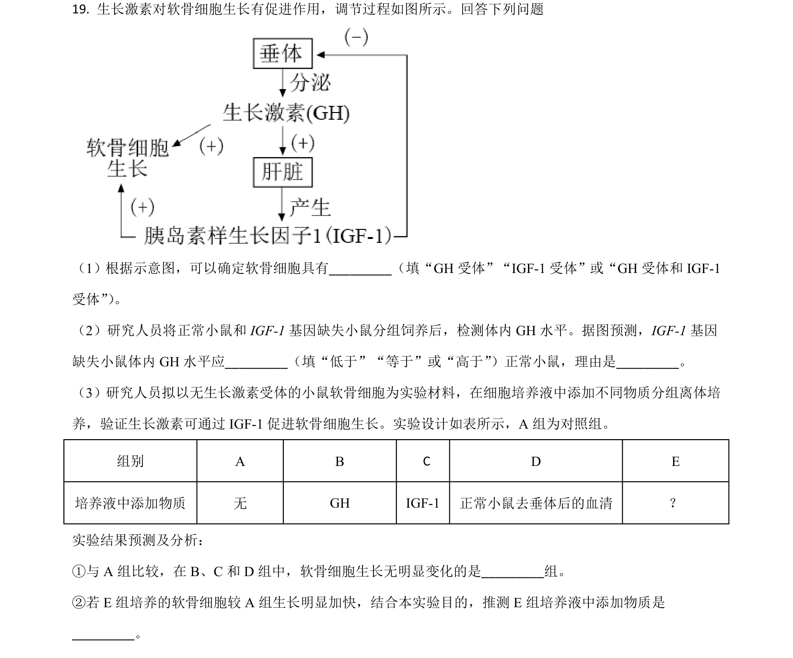
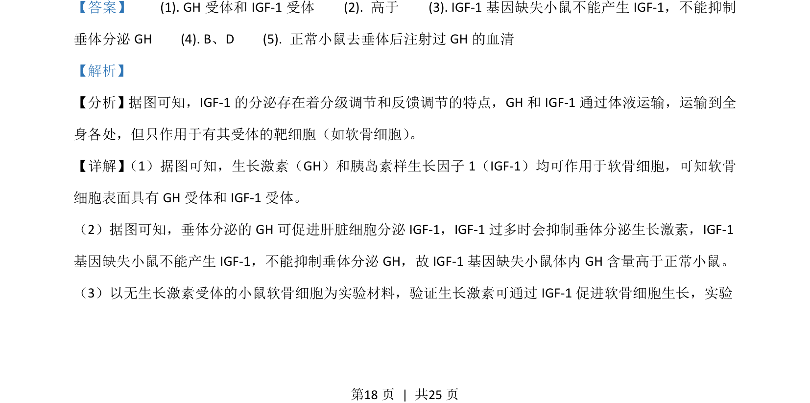
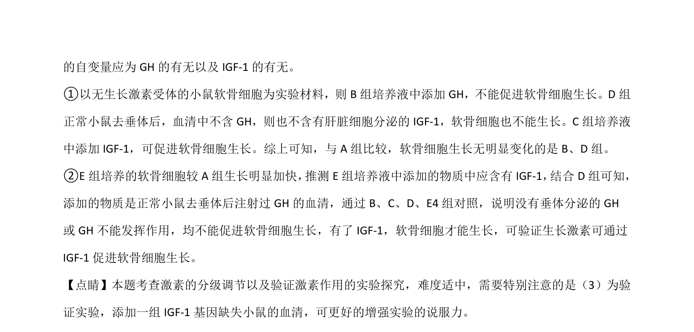

## 题面

## 摘要

该题考查生长激素调节机制及验证实验设计，以及种群密度调查与种间关系分析。

## 关联考点

- [[激素分级调节]]
- [[334-反馈调节|反馈调节]]
- [[482-实验设计|实验设计]]
- [[664-种群密度调查|种群密度调查]]

## 答案与解析

> 📄 原 PDF 第 18 页：`素材/真题/湖南/2008-2024·（湖南）生物高考真题/2021年高考生物试卷（湖南）（解析卷）.pdf`
