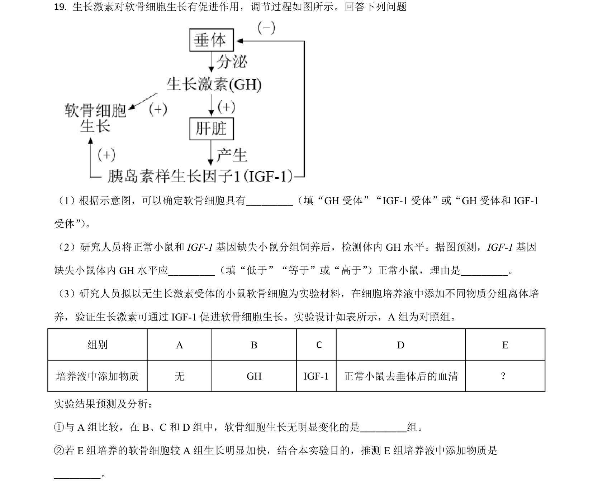
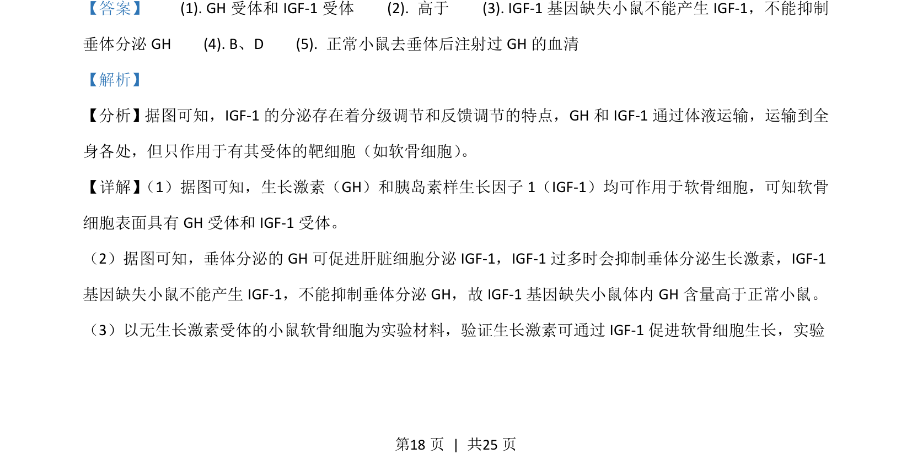
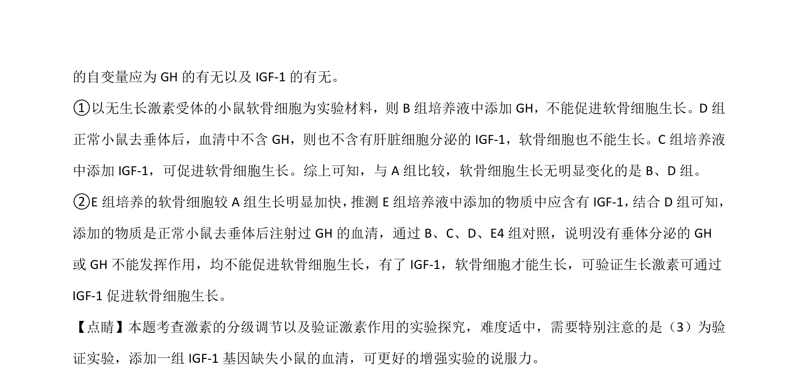

## 题面

## 摘要

该题考查生长激素调节机制及验证实验设计，以及种群密度调查与种间关系分析。

## 关联考点

- [[激素分级调节]]
- [[334-反馈调节|反馈调节]]
- [[482-实验设计|实验设计]]
- [[664-种群密度调查|种群密度调查]]

## 答案与解析

> 📄 原 PDF 第 18 页：`素材/真题/湖南/2008-2024·（湖南）生物高考真题/2021年高考生物试卷（湖南）（解析卷）.pdf`

<!-- 题干文本-start -->
## 题干文本
19. 生长激素对软骨细胞生长有促进作用，调节过程如图所示。回答下列问题
（1）根据示意图，可以确定软骨细胞具有_________（填“GH 受体”“IGF-1 受体”或“GH 受体和 IGF-1
受体”） 。
（2）研究人员将正常小鼠和 IGF-1 基因缺失小鼠分组饲养后，检测体内 GH 水平。据图预测，IGF-1 基因
缺失小鼠体内 GH 水平应_________（填“低于”“等于”或“高于”）正常小鼠，理由是_________。
（3）研究人员拟以无生长激素受体的小鼠软骨细胞为实验材料，在细胞培养液中添加不同物质分组离体培
养，验证生长激素可通过 IGF-1 促进软骨细胞生长。实验设计如表所示，A 组为对照组。
组别 A B  C D E
培养液中添加物质 无 GH IGF-1 正常小鼠去垂体后的血清 ？
实验结果预测及分析：
①与 A 组比较，在 B、C和 D 组中，软骨细胞生长无明显变化的是_________组。
②若 E组培养的软骨细胞较 A 组生长明显加快，结合本实验目的，推测 E组培养液中添加物质是
_________。
<!-- 题干文本-end -->

<!-- 解析文本-start -->
## 解析文本
【答案】    (1). GH 受体和 IGF-1 受体    (2). 高于    (3). IGF-1 基因缺失小鼠不能产生 IGF-1，不能抑制
垂体分泌 GH    (4). B 、D    (5). 正常小鼠去垂体后注射过 GH的血清
【解析】
【分析】据图可知，IGF-1 的分泌存在着分级调节和反馈调节的特点，GH和 IGF-1 通过体液运输，运输到全
身各处，但只作用于有其受体的靶细胞（如软骨细胞） 。
【详解】 （1）据图可知，生长激素（GH）和胰岛素样生长因子 1（IGF-1）均可作用于软骨细胞，可知软骨
细胞表面具有 GH受体和 IGF-1 受体。
（2）据图可知，垂体分泌的 GH可促进肝脏细胞分泌 IGF-1，IGF-1 过多时会抑制垂体分泌生长激素，IGF-1
基因缺失小鼠不能产生 IGF-1，不能抑制垂体分泌 GH，故 IGF-1 基因缺失小鼠体内 GH含量高于正常小鼠。
（3）以无生长激素受体的小鼠软骨细胞为实验材料，验证生长激素可通过 IGF-1 促进软骨细胞生长，实验
<!-- 解析文本-end -->
