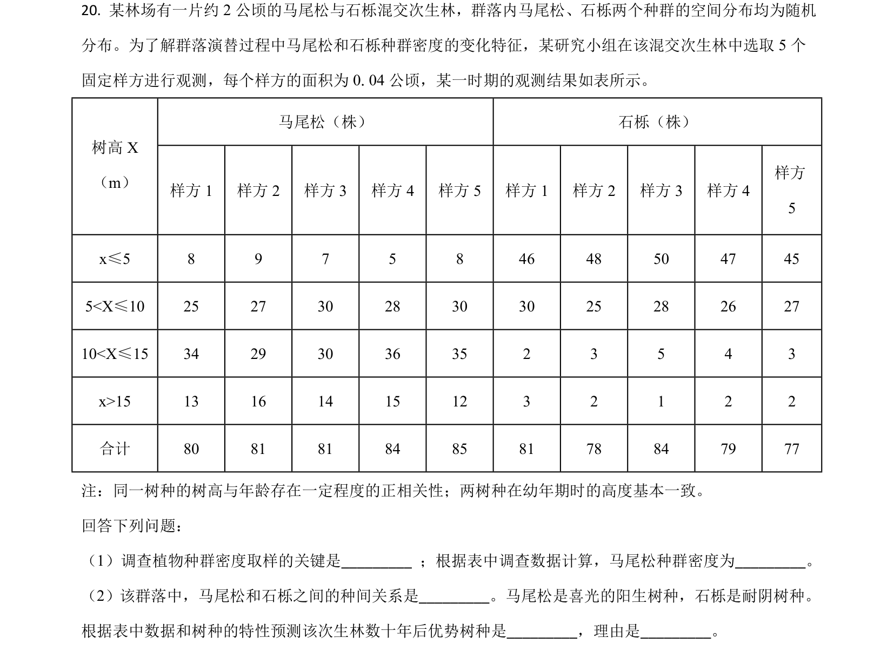
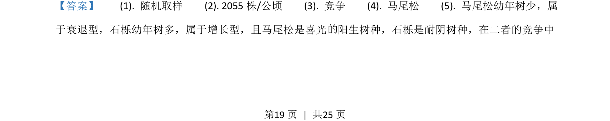
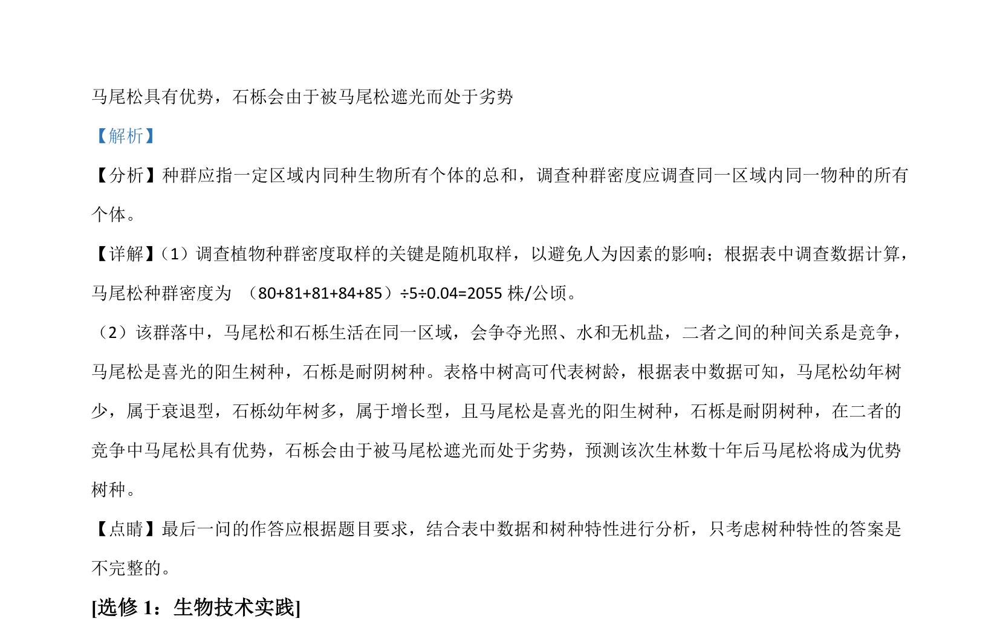

## 题面

## 摘要

该题考查种群密度调查、种间关系与年龄结构预测，以及纤维素分解菌筛选与酶活力分析。

## 关联考点

- [[370-种群密度|种群密度]]
- [[667-种间竞争|种间竞争]]
- [[780-年龄结构|年龄结构]]
- [[912-纤维素酶|纤维素酶]]

## 答案与解析

> 📄 原 PDF 第 19 页：`素材/真题/湖南/2008-2024·（湖南）生物高考真题/2021年高考生物试卷（湖南）（解析卷）.pdf`
