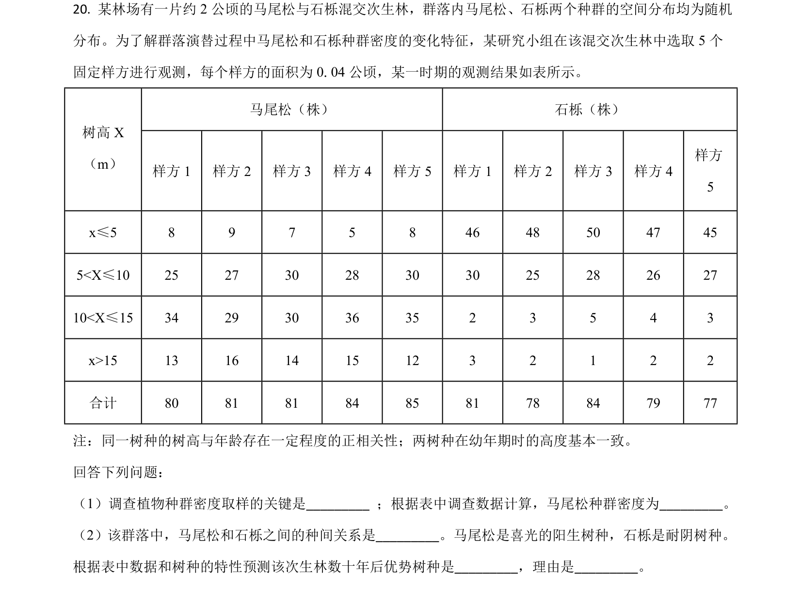
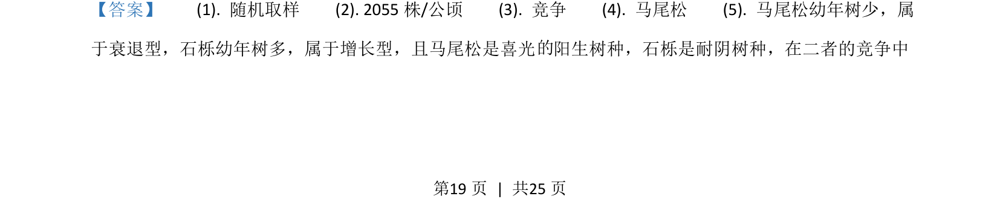
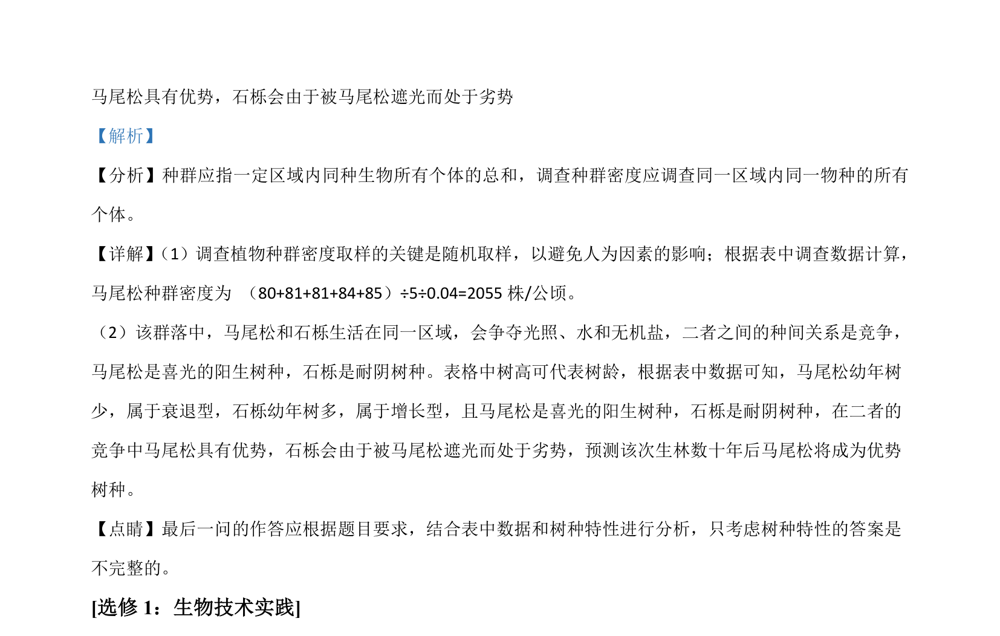

## 题面

## 摘要

该题考查种群密度调查、种间关系与年龄结构预测，以及纤维素分解菌筛选与酶活力分析。

## 关联考点

- [[370-种群密度|种群密度]]
- [[667-种间竞争|种间竞争]]
- [[780-年龄结构|年龄结构]]
- [[912-纤维素酶|纤维素酶]]

## 答案与解析

> 📄 原 PDF 第 19 页：`素材/真题/湖南/2008-2024·（湖南）生物高考真题/2021年高考生物试卷（湖南）（解析卷）.pdf`

<!-- 题干文本-start -->
## 题干文本
20. 某林场有一片约 2 公顷的马尾松与石栎混交次生林，群落内马尾松、石栎两个种群的空间分布均为随机
分布。为了解群落演替过程中马尾松和石栎种群密度的变化特征，某研究小组在该混交次生林中选取 5 个
固定样方进行观测，每个样方的面积为 0.04 公顷，某一时期的观测结果如表所示。
马尾松（株） 石栎（株）
树高 X
（m） 样方 1 样方 2 样方 3 样方 4 样方 5 样方 1 样方 2 样方 3 样方 4
样方
5
x≤5 8 9 7 5 8 46 48 50 47 45
5<X≤10 25 27 30 28 30 30 25 28 26 27
10<X≤15 34 29 30 36 35 2 3 5 4 3
x>15 13 16 14 15 12 3 2 1 2 2
合计 80 81 81 84 85 81 78 84 79 77
注：同一树种的树高与年龄存在一定程度的正相关性；两树种在幼年期时的高度基本一致。
回答下列问题：
（1）调查植物种群密度取样的关键是_________ ；根据表中调查数据计算，马尾松种群密度为_________。
（2）该群落中，马尾松和石栎之间的种间关系是_________。马尾松是喜光的阳生树种，石栎是耐阴树种。
根据表中数据和树种的特性预测该次生林数十年后优势树种是_________，理由是_________。
<!-- 题干文本-end -->

<!-- 解析文本-start -->
## 解析文本
【答案】    (1). 随机取样    (2). 2055 株/公顷    (3). 竞争    (4). 马尾松    (5). 马尾松幼年树少，属
于衰退型，石栎幼年树多，属于增长型，且马尾松是喜光 阳生树种，石栎是耐阴树种，在二者的竞争中的
<!-- 解析文本-end -->
