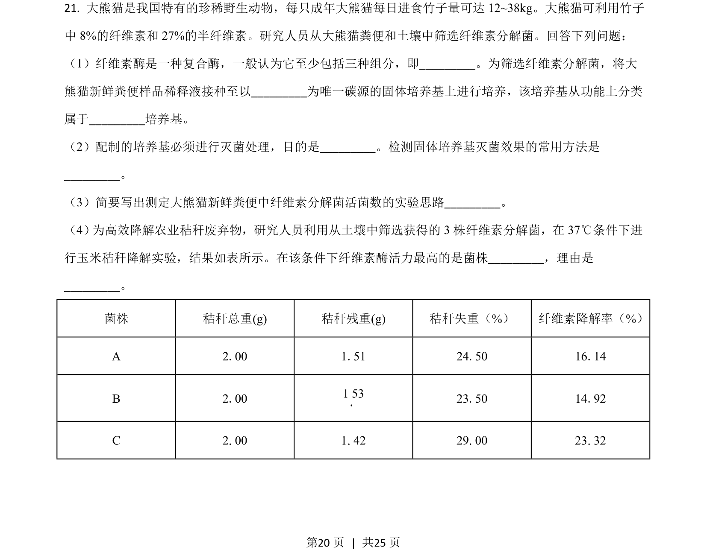
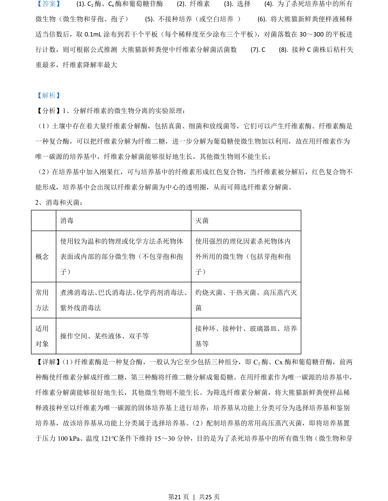
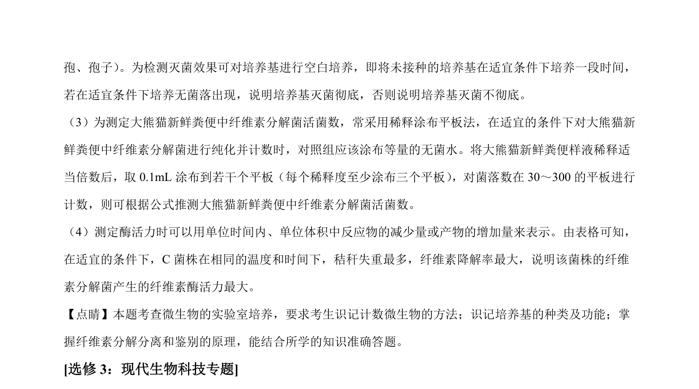

## 题面

## 摘要

本题从粪便样品中筛选纤维素分解菌，涉及选择培养基制备、灭菌、接种计数及酶活力测定。

## 关联考点

- [[912-纤维素酶|纤维素酶]]
- [[427-培养基|选择培养基]]
- [[高压蒸汽灭菌]]
- [[755-稀释涂布平板法|稀释涂布平板法]]

## 答案与解析

> 📄 原 PDF 第 20 页：`素材/真题/湖南/2008-2024·（湖南）生物高考真题/2021年高考生物试卷（湖南）（解析卷）.pdf`
