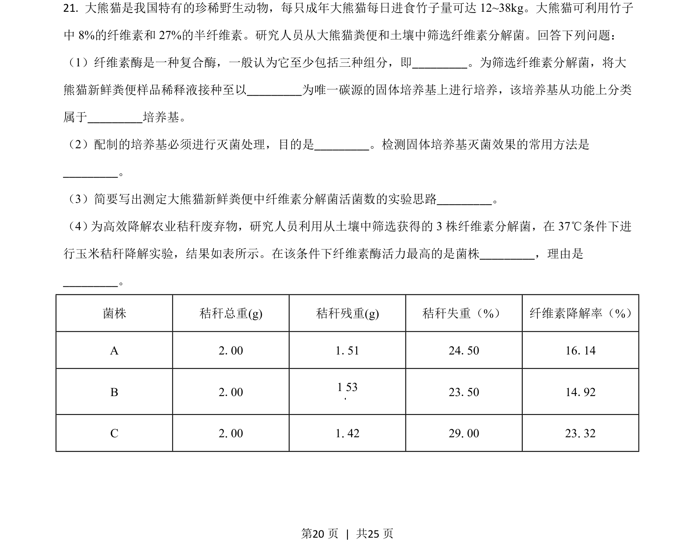
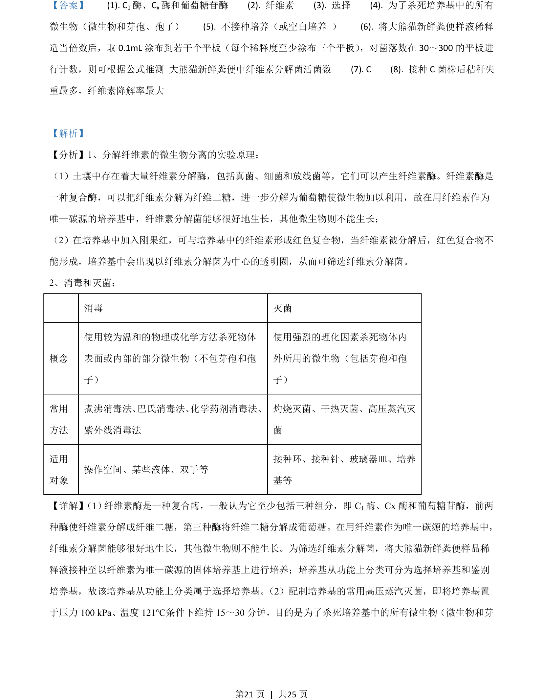
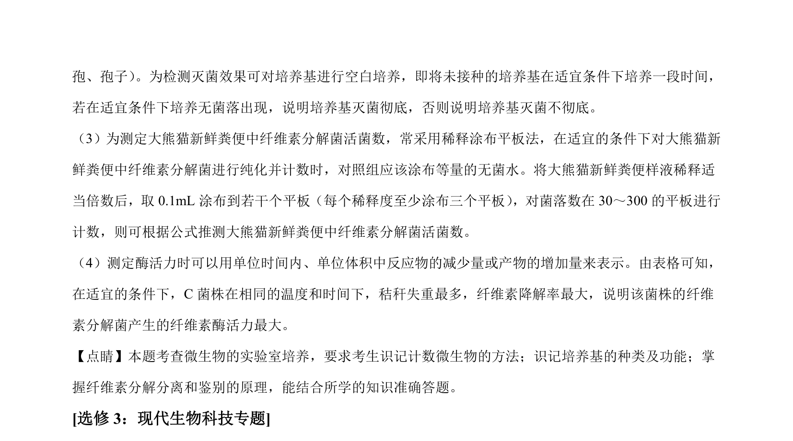

## 题面

## 摘要

本题从粪便样品中筛选纤维素分解菌，涉及选择培养基制备、灭菌、接种计数及酶活力测定。

## 关联考点

- [[912-纤维素酶|纤维素酶]]
- [[427-培养基|选择培养基]]
- [[高压蒸汽灭菌]]
- [[755-稀释涂布平板法|稀释涂布平板法]]

## 答案与解析

> 📄 原 PDF 第 20 页：`素材/真题/湖南/2008-2024·（湖南）生物高考真题/2021年高考生物试卷（湖南）（解析卷）.pdf`

<!-- 题干文本-start -->
## 题干文本
21. 大熊猫是我国特有的珍稀野生动物，每只成年大熊猫每日进食竹子量可达 12~38kg。大熊猫可利用竹子
中 8%的纤维素和 27%的半纤维素。研究人员从大熊猫粪便和土壤中筛选纤维素分解菌。回答下列问题：
（1）纤维素酶是一种复合酶，一般认为它至少包括三种组分，即_________。为筛选纤维素分解菌，将大
熊猫新鲜粪便样品稀释液接种至以_________为唯一碳源的固体培养基上进行培养，该培养基从功能上分类
属于_________培养基。
（2）配制的培养基必须进行灭菌处理，目的是_________。检测固体培养基灭菌效果的常用方法是
_________。
（3）简要写出测定大熊猫新鲜粪便中纤维素分解菌活菌数的实验思路_________。
（4） 为高效降解农业秸秆废弃物，研究人员利用从土壤中筛选获得的3 株纤维素分解菌，在 37℃条件下进
行玉米秸秆降解实验，结果如表所示。在该条件下纤维素酶活力最高的是菌株_________，理由是
_________。
菌株 秸秆总重(g) 秸秆残重(g) 秸秆失重（%） 纤维素降解率（%）
A 2.00 1.51 24.50 16.14
B 2.00 1.53 23.50 14.92
C 2.00 1.42 29.00 23.32
<!-- 题干文本-end -->

<!-- 解析文本-start -->
## 解析文本

<!-- 解析文本-end -->
