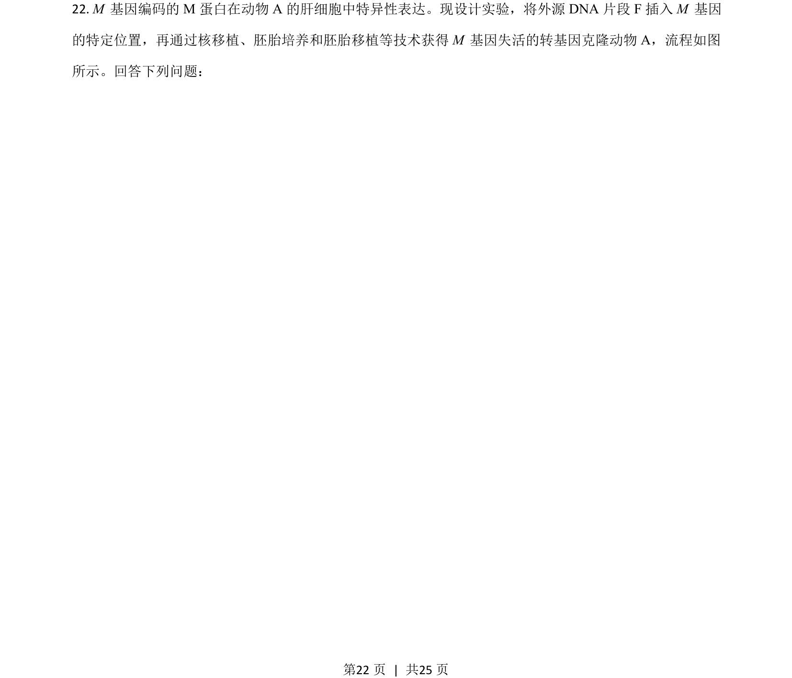
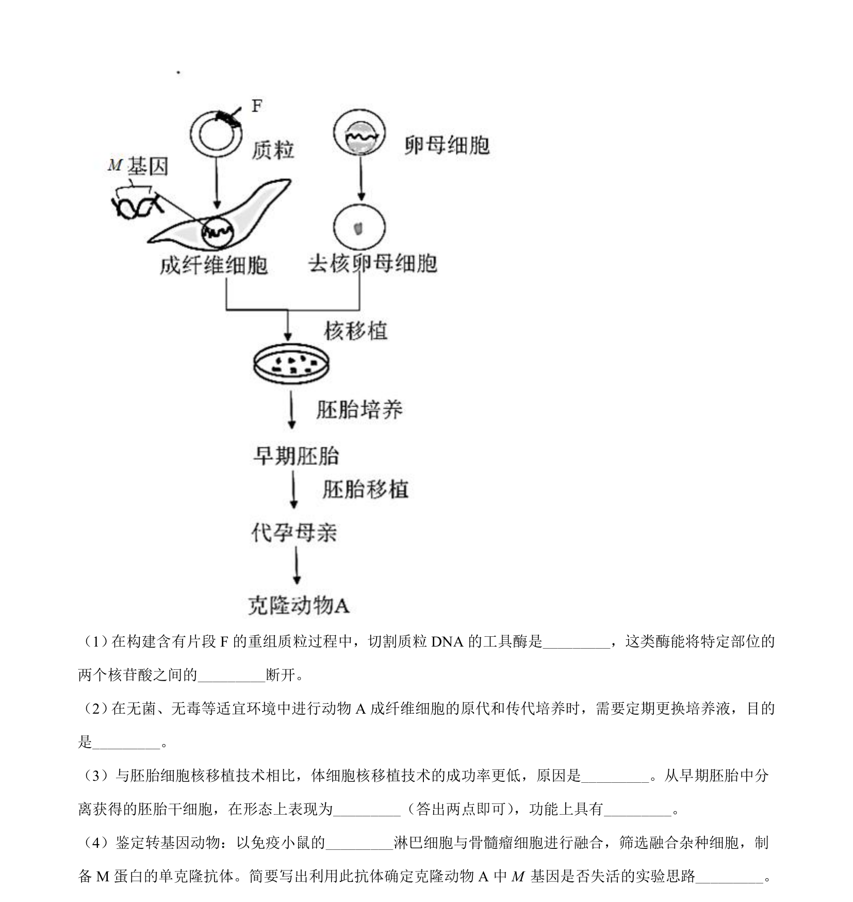
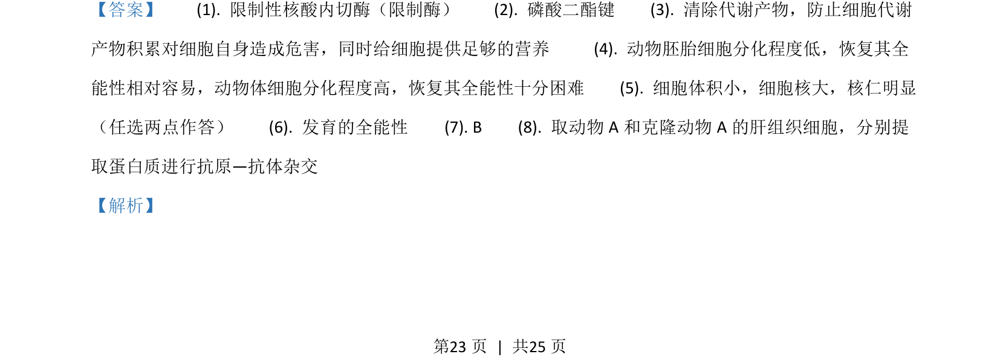
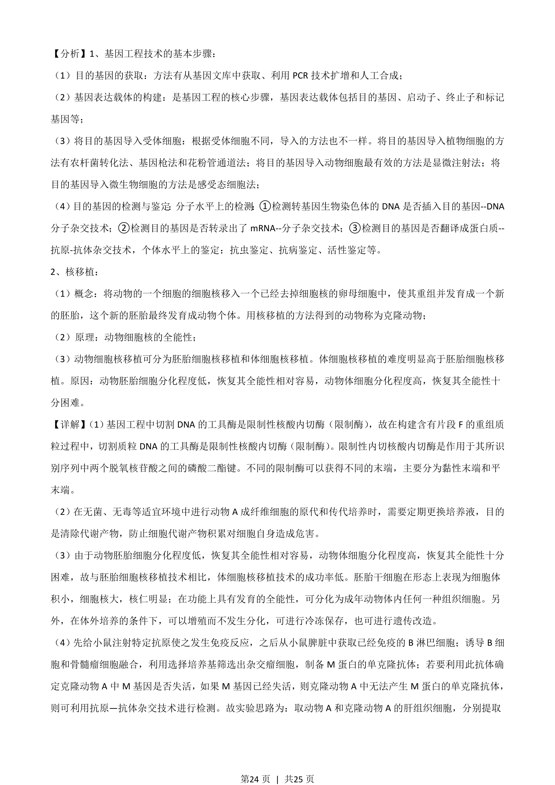
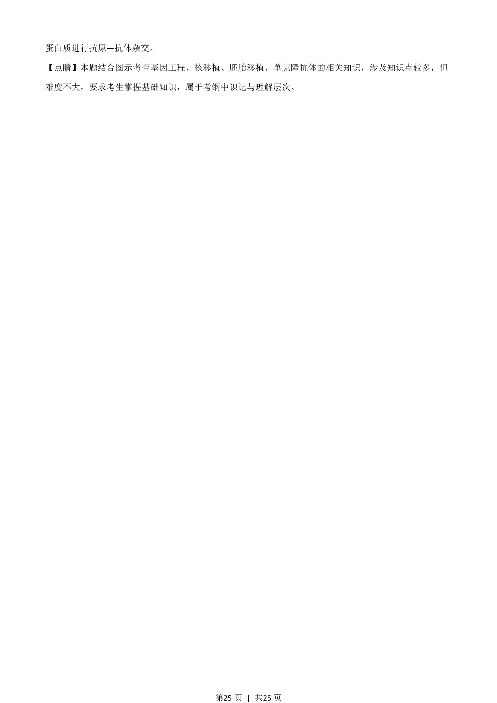

## 题面

## 摘要

该题综合考查基因工程、核移植和单克隆抗体等现代生物技术的基础知识与应用。

## 关联考点

- [[411-基因工程|基因工程]]
- [[680-细胞核移植|核移植]]
- [[451-单克隆抗体|单克隆抗体]]
- [[抗原-抗体杂交]]

## 答案与解析

> 📄 原 PDF 第 22 页：`素材/真题/湖南/2008-2024·（湖南）生物高考真题/2021年高考生物试卷（湖南）（解析卷）.pdf`
