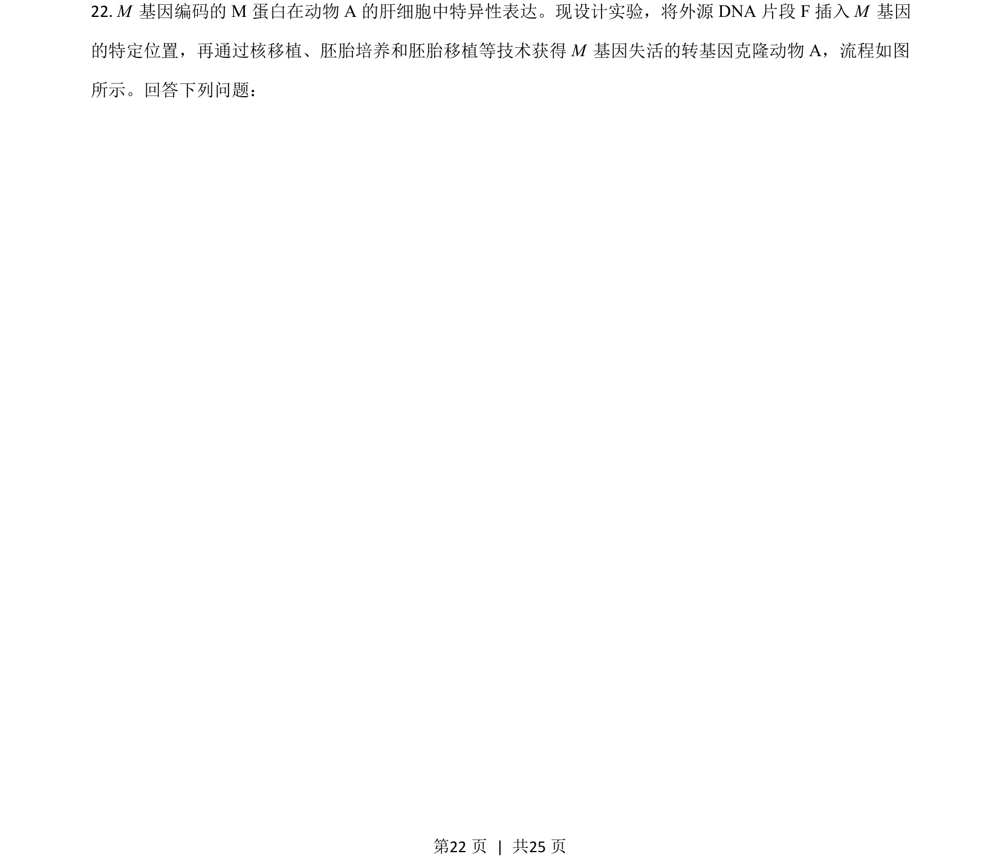
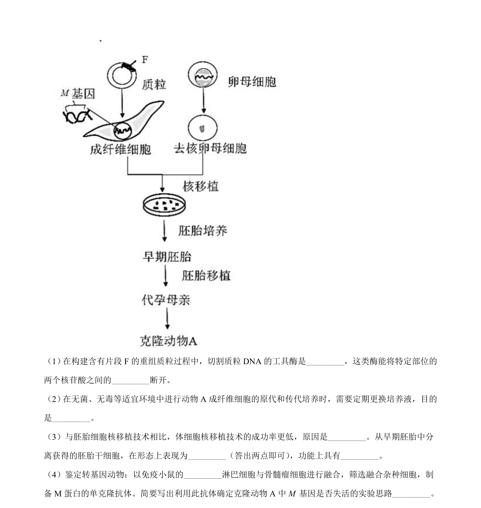
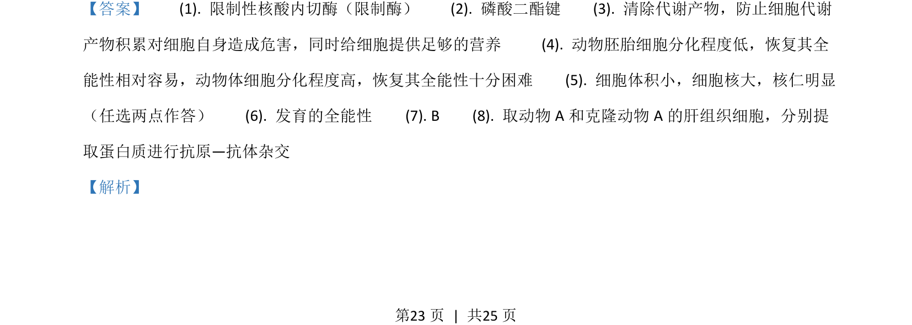
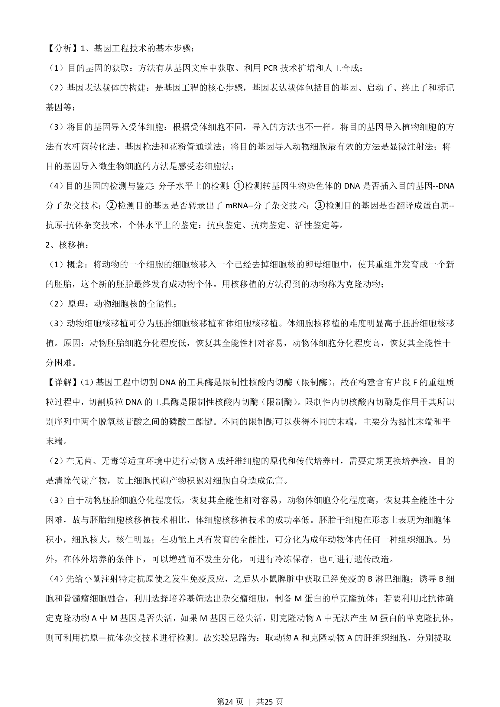
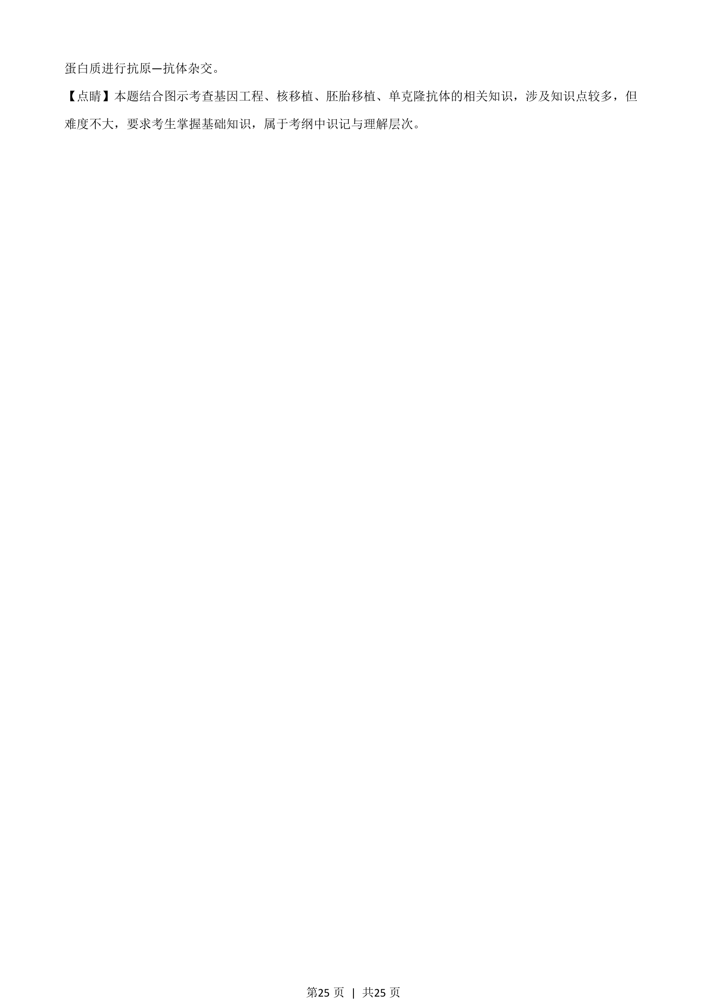

## 题面

## 摘要

该题综合考查基因工程、核移植和单克隆抗体等现代生物技术的基础知识与应用。

## 关联考点

- [[411-基因工程|基因工程]]
- [[680-细胞核移植|核移植]]
- [[451-单克隆抗体|单克隆抗体]]
- [[抗原-抗体杂交]]

## 答案与解析

> 📄 原 PDF 第 22 页：`素材/真题/湖南/2008-2024·（湖南）生物高考真题/2021年高考生物试卷（湖南）（解析卷）.pdf`

<!-- 题干文本-start -->
## 题干文本
22. M 基因编码的 M 蛋白在动物 A 的肝细胞中特异性表达。现设计实验，将外源 DNA 片段 F 插入 M 基因
的特定位置，再通过核移植、胚胎培养和胚胎移植等技术获得 M 基因失活的转基因克隆动物 A，流程如图
所示。回答下列问题：
<!-- 题干文本-end -->

<!-- 解析文本-start -->
## 解析文本

<!-- 解析文本-end -->
