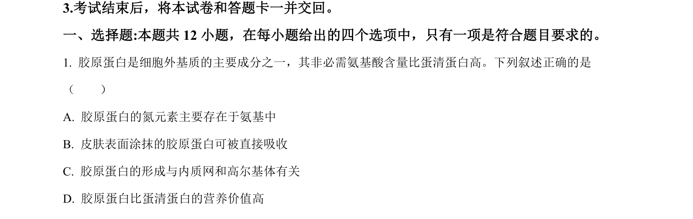
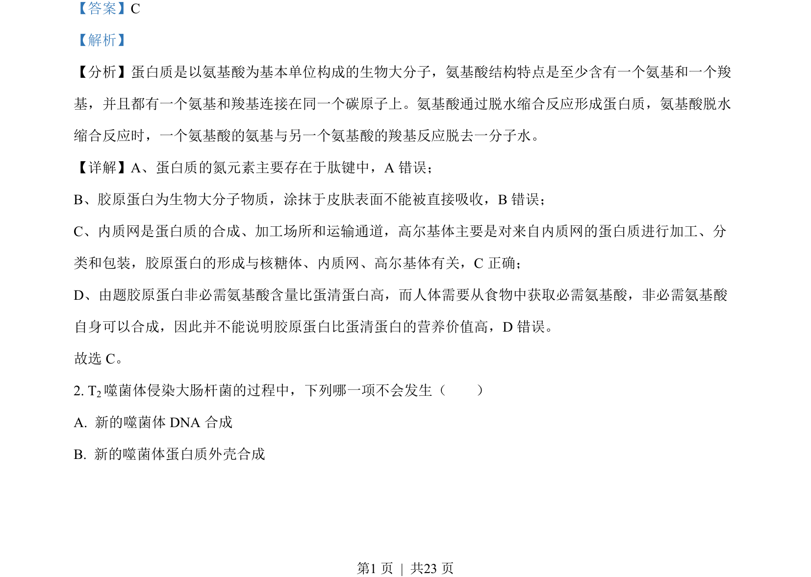
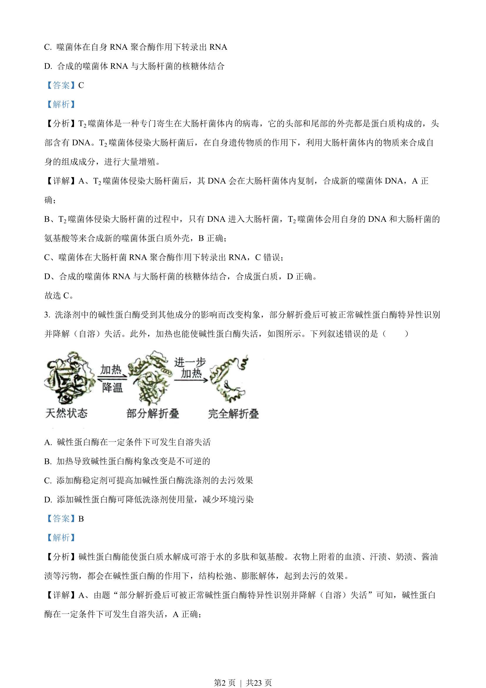
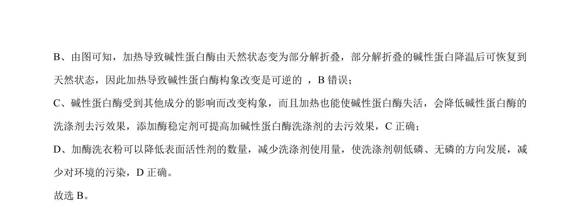

## 题面

## 摘要

碱性蛋白酶自溶失活、构象变化及加酶洗衣粉应用

## 关联考点

- [[碱性蛋白酶]]
- [[518-酶活性|酶活性]]
- [[蛋白质构象]]
- [[加酶洗衣粉]]

## 答案与解析

> 📄 原 PDF 第 1 页：`素材/真题/湖南/2008-2024·（湖南）生物高考真题/2022年高考生物试卷（湖南）（解析卷）.pdf`

<!-- 题干文本-start -->
## 题干文本
3.考试结束后，将本试卷和答题卡一并交回。
一、选择题:本题共 12 小题，在每小题给出的四个选项中，只有一项是符合题目要求的。
1. 胶原蛋白是细胞外基质的主要成分之一，其非必需氨基酸含量比蛋清蛋白高。下列叙述正确的是
（　　）
A. 胶原蛋白的氮元素主要存在于氨基中
B. 皮肤表面涂抹的胶原蛋白可被直接吸收
C. 胶原蛋白的形成与内质网和高尔基体有关
D. 胶原蛋白比蛋清蛋白的营养价值高
<!-- 题干文本-end -->

<!-- 解析文本-start -->
## 解析文本
【答案】C
【解析】
【分析】蛋白质是以氨基酸为基本单位构成的生物大分子，氨基酸结构特点是至少含有一个氨基和一个羧
基，并且都有一个氨基和羧基连接在同一个碳原子上。氨基酸通过脱水缩合反应形成蛋白质，氨基酸脱水
缩合反应时，一个氨基酸的氨基与另一个氨基酸的羧基反应脱去一分子水。
【详解】A、蛋白质的氮元素主要存在于肽键中，A 错误；
B、胶原蛋白为生物大分子物质，涂抹于皮肤表面不能被直接吸收，B错误；
C、内质网是蛋白质的合成、加工场所和运输通道，高尔基体主要是对来自内质网的蛋白质进行加工、分
类和包装，胶原蛋白的形成与核糖体、内质网、高尔基体有关，C正确；
D、由题胶原蛋白非必需氨基酸含量比蛋清蛋白高，而人体需要从食物中获取必需氨基酸，非必需氨基酸
自身可以合成，因此并不能说明胶原蛋白比蛋清蛋白的营养价值高，D 错误。
故选 C。
2. T2噬菌体侵染大肠杆菌的过程中，下列哪一项不会发生（　　）
A. 新的噬菌体 DNA 合成
B. 新的噬菌体蛋白质外壳合成
<!-- 解析文本-end -->
