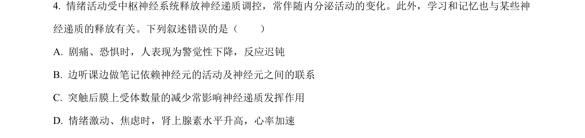
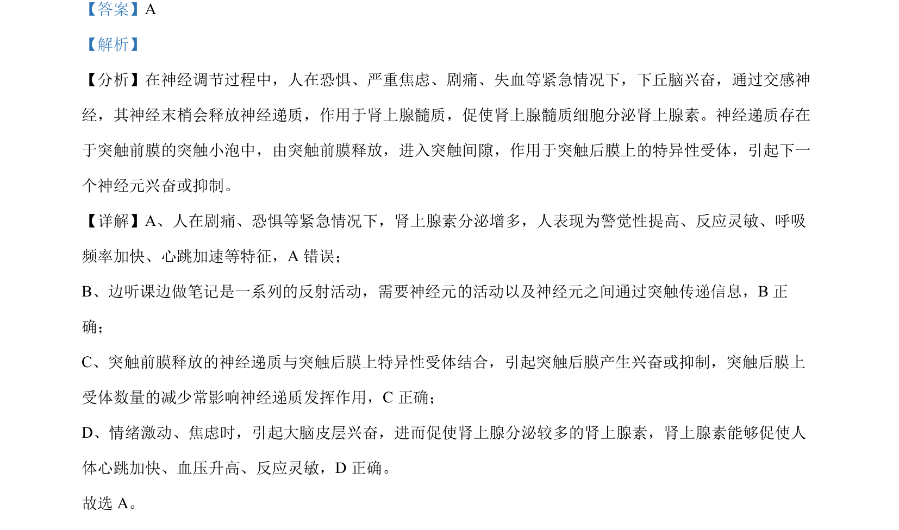

## 题面

## 摘要

考查神经调节中肾上腺素的作用、突触传递过程及反射活动的特点。

## 关联考点

- [[324-神经调节|神经调节]]
- [[339-肾上腺素|肾上腺素]]
- [[326-突触|突触]]
- [[084-反射|反射]]

## 答案与解析

> 📄 原 PDF 第 3 页：`素材/真题/湖南/2008-2024·（湖南）生物高考真题/2022年高考生物试卷（湖南）（解析卷）.pdf`
