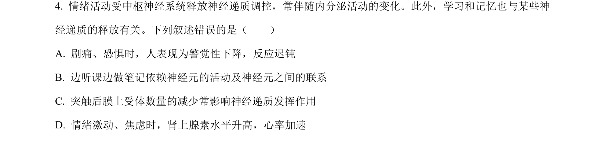
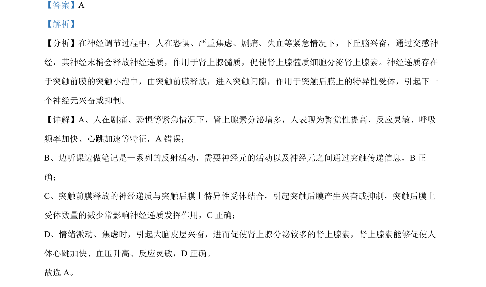

## 题面

## 摘要

考查神经调节中肾上腺素的作用、突触传递过程及反射活动的特点。

## 关联考点

- [[324-神经调节|神经调节]]
- [[339-肾上腺素|肾上腺素]]
- [[326-突触|突触]]
- [[084-反射|反射]]

## 答案与解析

> 📄 原 PDF 第 3 页：`素材/真题/湖南/2008-2024·（湖南）生物高考真题/2022年高考生物试卷（湖南）（解析卷）.pdf`

<!-- 题干文本-start -->
## 题干文本
4. 情绪活动受中枢神经系统释放神经递质调控，常伴随内分泌活动的变化。此外，学习和记忆也与某些神
经递质的释放有关。下列叙述错误的是（　　）
A. 剧痛、恐惧时，人表现为警觉性下降，反应迟钝
B. 边听课边做笔记依赖神经元的活动及神经元之间的联系
C. 突触后膜上受体数量的减少常影响神经递质发挥作用
D. 情绪激动、焦虑时，肾上腺素水平升高，心率加速
<!-- 题干文本-end -->

<!-- 解析文本-start -->
## 解析文本
【答案】A
【解析】
【分析】在神经调节过程中，人在恐惧、严重焦虑、剧痛、失血等紧急情况下，下丘脑兴奋，通过交感神
经，其神经末梢会释放神经递质，作用于肾上腺髓质，促使肾上腺髓质细胞分泌肾上腺素。神经递质存在
于突触前膜的突触小泡中，由突触前膜释放，进入突触间隙，作用于突触后膜上的特异性受体，引起下一
个神经元兴奋或抑制。
【详解】A、人在剧痛、恐惧等紧急情况下，肾上腺素分泌增多，人表现为警觉性提高、反应灵敏、呼吸
频率加快、心跳加速等特征，A 错误；
B、边听课边做笔记是一系列的反射活动，需要神经元的活动以及神经元之间通过突触传递信息，B正
确；
C、突触前膜释放的神经递质与突触后膜上特异性受体结合，引起突触后膜产生兴奋或抑制，突触后膜上
受体数量的减少常影响神经递质发挥作用，C正确；
D、情绪激动、焦虑时，引起大脑皮层兴奋，进而促使肾上腺分泌较多的肾上腺素，肾上腺素能够促使人
体心跳加快、血压升高、反应灵敏，D 正确。
故选 A。
<!-- 解析文本-end -->
