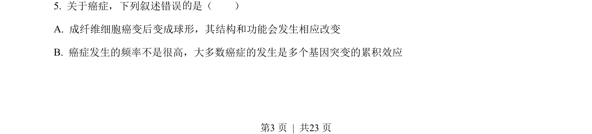
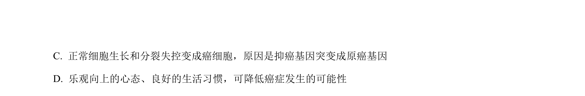
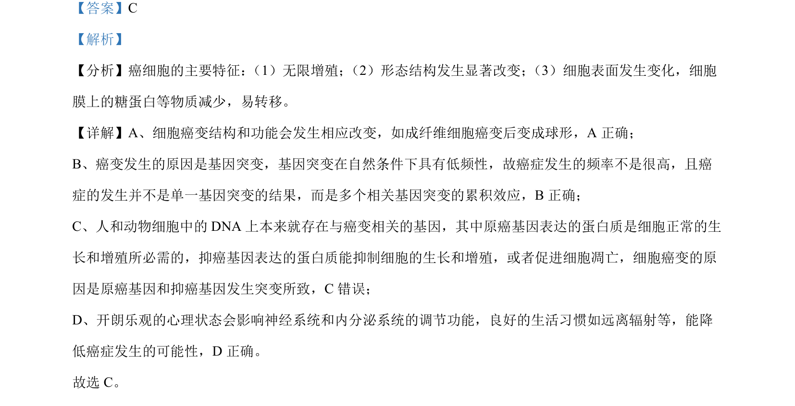

## 题面

## 摘要

癌细胞的特征、癌变机理及相关基因（原癌基因与抑癌基因）的辨析

## 关联考点

- [[815-癌细胞特征|癌细胞特征]]
- [[301-基因突变|基因突变]]
- [[928-原癌基因与抑癌基因|原癌基因与抑癌基因]]

## 答案与解析

> 📄 原 PDF 第 3 页：`素材/真题/湖南/2008-2024·（湖南）生物高考真题/2022年高考生物试卷（湖南）（解析卷）.pdf`
