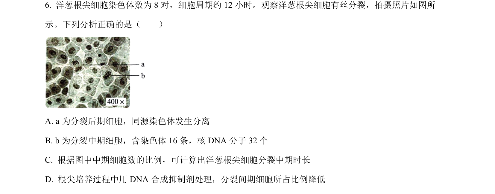
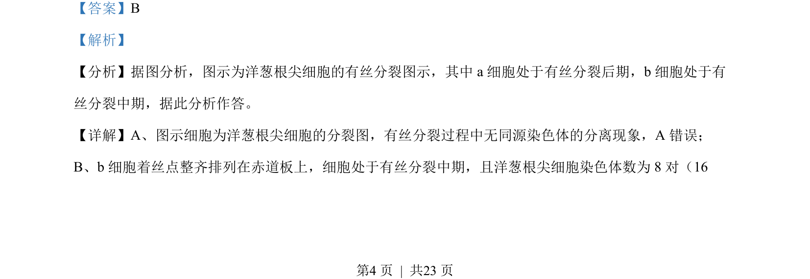
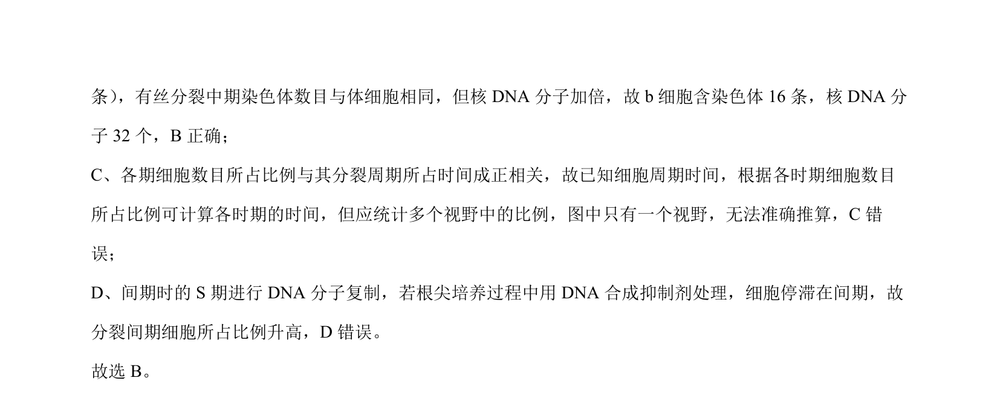

## 题面

## 摘要

洋葱根尖细胞有丝分裂各时期特征及染色体、DNA数目变化分析

## 关联考点

- [[046-细胞分裂|有丝分裂]]
- [[616-染色体数目|染色体数目]]
- [[核DNA数目]]
- [[252-细胞周期|细胞周期]]

## 答案与解析

> 📄 原 PDF 第 4 页：`素材/真题/湖南/2008-2024·（湖南）生物高考真题/2022年高考生物试卷（湖南）（解析卷）.pdf`
