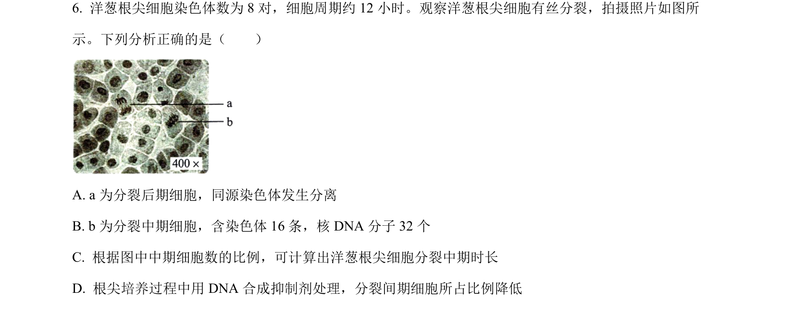
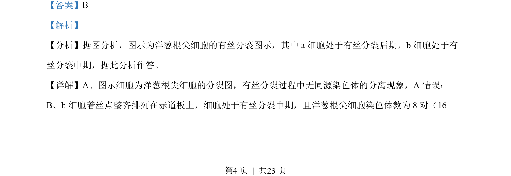
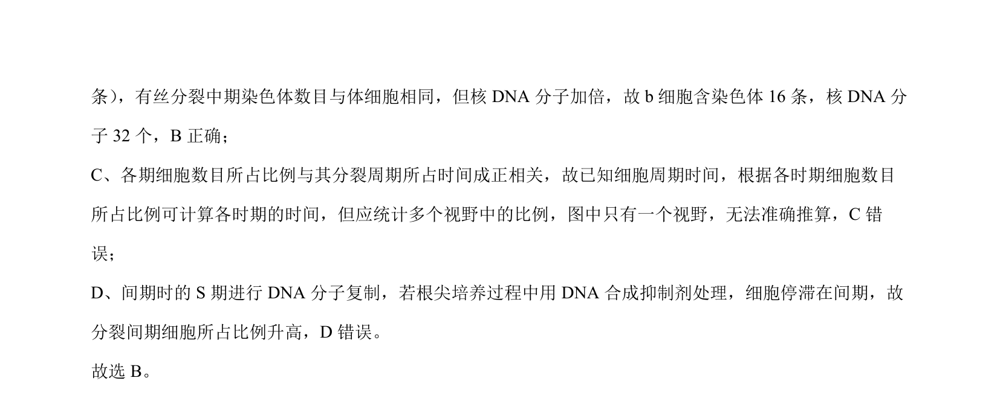

## 题面

## 摘要

洋葱根尖细胞有丝分裂各时期特征及染色体、DNA数目变化分析

## 关联考点

- [[046-细胞分裂|有丝分裂]]
- [[616-染色体数目|染色体数目]]
- [[核DNA数目]]
- [[252-细胞周期|细胞周期]]

## 答案与解析

> 📄 原 PDF 第 4 页：`素材/真题/湖南/2008-2024·（湖南）生物高考真题/2022年高考生物试卷（湖南）（解析卷）.pdf`

<!-- 题干文本-start -->
## 题干文本
6. 洋葱根尖细胞染色体数为 8 对，细胞周期约 12 小时。观察洋葱根尖细胞有丝分裂，拍摄照片如图所
示。下列分析正确的是（　　）
A. a 为分裂后期细胞，同源染色体发生分离
B. b为分裂中期细胞，含染色体 16 条，核 DNA 分子 32 个
C. 根据图中中期细胞数的比例，可计算出洋葱根尖细胞分裂中期时长
D. 根尖培养过程中用 DNA 合成抑制剂处理，分裂间期细胞所占比例降低
<!-- 题干文本-end -->

<!-- 解析文本-start -->
## 解析文本
【答案】B
【解析】
【分析】据图分析，图示为洋葱根尖细胞的有丝分裂图示，其中 a细胞处于有丝分裂后期，b 细胞处于有
丝分裂中期，据此分析作答。
【详解】A、图示细胞为洋葱根尖细胞的分裂图，有丝分裂过程中无同源染色体的分离现象，A 错误；
B、b 细胞着丝点整齐排列在赤道板上，细胞处于有丝分裂中期，且洋葱根尖细胞染色体数为 8 对（16
<!-- 解析文本-end -->
