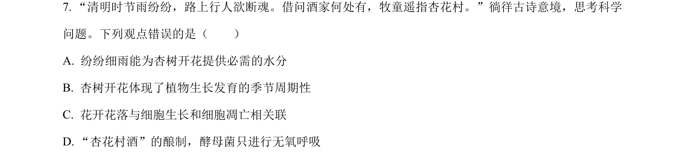
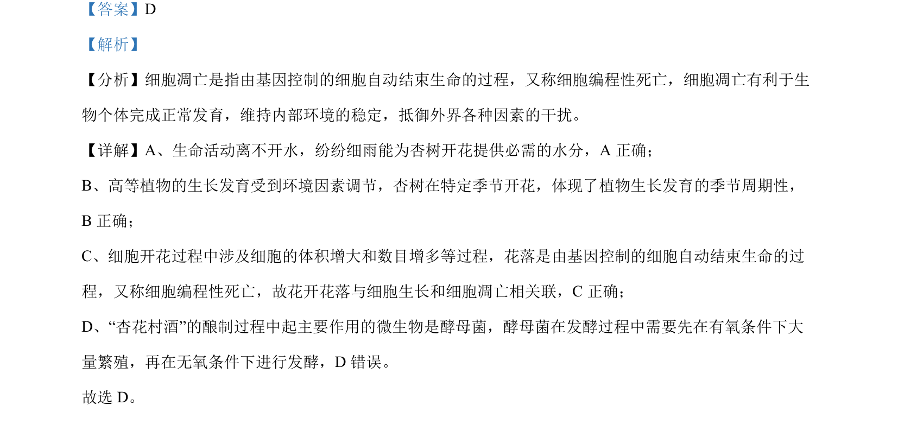

## 题面

## 摘要

考查细胞凋亡、植物生长发育的环境调节及微生物发酵的基本概念

## 关联考点

- [[250-细胞凋亡|细胞凋亡]]
- [[植物生长发育的季节周期性]]
- [[酵母菌的有氧呼吸与无氧呼吸]]

## 答案与解析

> 📄 原 PDF 第 5 页：`素材/真题/湖南/2008-2024·（湖南）生物高考真题/2022年高考生物试卷（湖南）（解析卷）.pdf`
