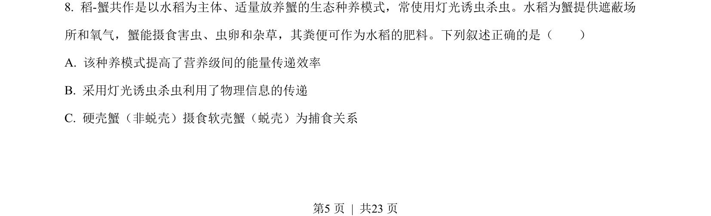
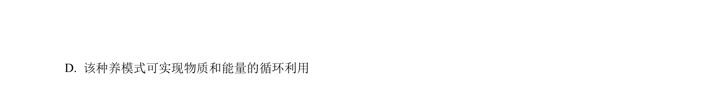
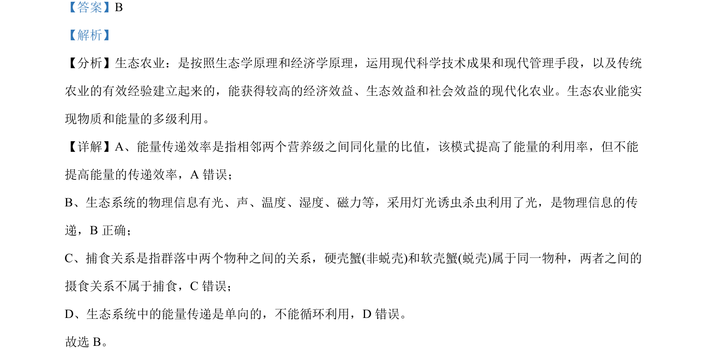

## 题面

## 摘要

该题考查生态农业原理，辨析能量利用率与传递效率、物理信息、捕食关系及能量流动特点。

## 关联考点

- [[440-生态农业|生态农业]]
- [[385-生态系统能量流动|能量流动]]
- [[379-信息传递|信息传递]]
- [[022-生物因素|种间关系]]

## 答案与解析

> 📄 原 PDF 第 5 页：`素材/真题/湖南/2008-2024·（湖南）生物高考真题/2022年高考生物试卷（湖南）（解析卷）.pdf`
