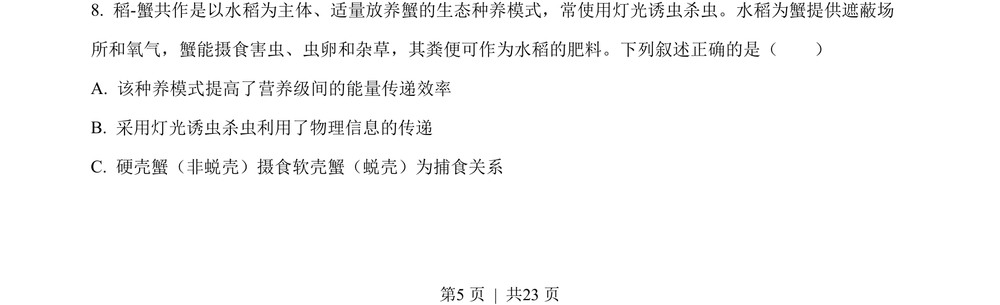
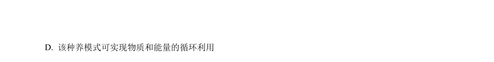
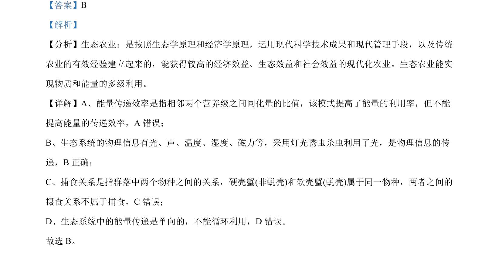

## 题面

## 摘要

该题考查生态农业原理，辨析能量利用率与传递效率、物理信息、捕食关系及能量流动特点。

## 关联考点

- [[440-生态农业|生态农业]]
- [[385-生态系统能量流动|能量流动]]
- [[379-信息传递|信息传递]]
- [[022-生物因素|种间关系]]

## 答案与解析

> 📄 原 PDF 第 5 页：`素材/真题/湖南/2008-2024·（湖南）生物高考真题/2022年高考生物试卷（湖南）（解析卷）.pdf`

<!-- 题干文本-start -->
## 题干文本
8. 稻-蟹共作是以水稻为主体、适量放养蟹的生态种养模式，常使用灯光诱虫杀虫。水稻为蟹提供遮蔽场
所和氧气，蟹能摄食害虫、虫卵和杂草，其粪便可作为水稻的肥料。下列叙述正确的是（　　）
A. 该种养模式提高了营养级间的能量传递效率
B. 采用灯光诱虫杀虫利用了物理信息的传递
C. 硬壳蟹（非蜕壳）摄食软壳蟹（蜕壳）为捕食关系
<!-- 题干文本-end -->

<!-- 解析文本-start -->
## 解析文本

<!-- 解析文本-end -->
