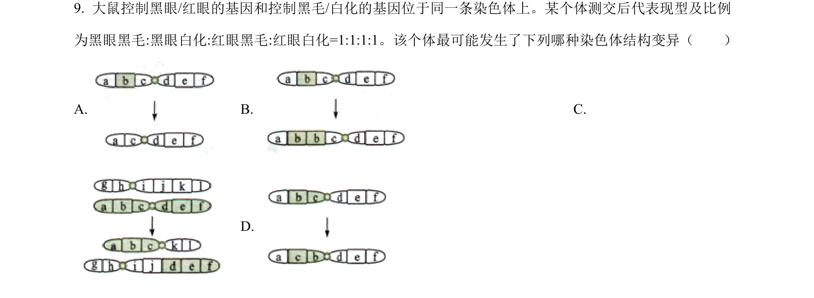
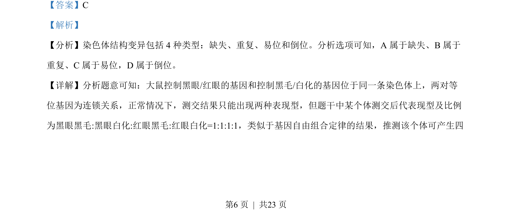
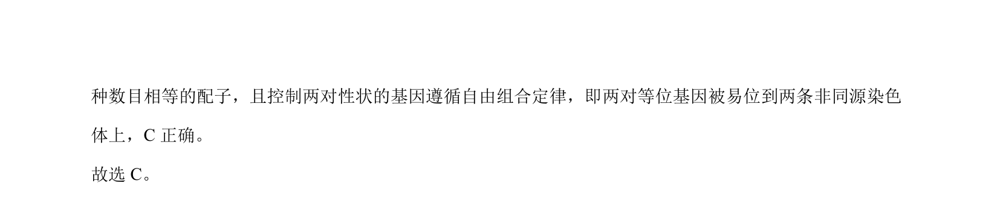

## 题面

## 摘要

该题考查染色体结构变异类型判断及质壁分离实验分析。

## 关联考点

- [[306-染色体结构变异|染色体结构变异]]
- [[262-质壁分离|质壁分离]]
- [[887-原生质体|原生质体]]
- [[基因连锁]]

## 答案与解析

> 📄 原 PDF 第 6 页：`素材/真题/湖南/2008-2024·（湖南）生物高考真题/2022年高考生物试卷（湖南）（解析卷）.pdf`
