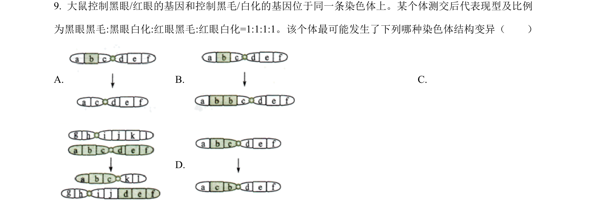
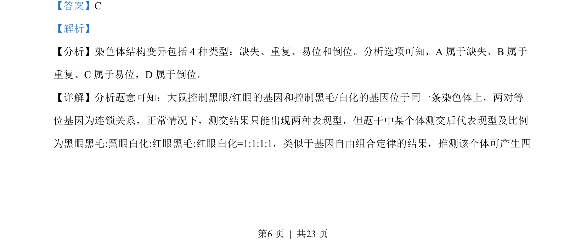
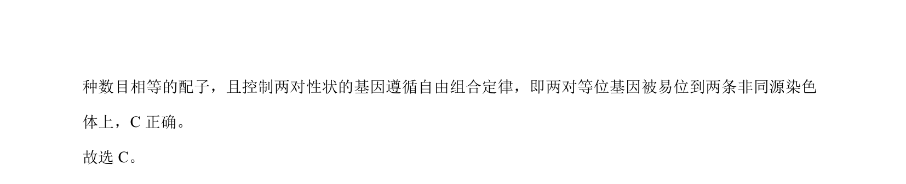

## 题面

## 摘要

该题考查染色体结构变异类型判断及质壁分离实验分析。

## 关联考点

- [[306-染色体结构变异|染色体结构变异]]
- [[262-质壁分离|质壁分离]]
- [[887-原生质体|原生质体]]
- [[基因连锁]]

## 答案与解析

> 📄 原 PDF 第 6 页：`素材/真题/湖南/2008-2024·（湖南）生物高考真题/2022年高考生物试卷（湖南）（解析卷）.pdf`

<!-- 题干文本-start -->
## 题干文本
9. 大鼠控制黑眼/红眼的基因和控制黑毛/白化的基因位于同一条染色体上。某个体测交后代表现型及比例
为黑眼黑毛:黑眼白化:红眼黑毛:红眼白化=1:1:1:1。该个体最可能发生了下列哪种染色体结构变异（　　）
A. B. C. 
D.
<!-- 题干文本-end -->

<!-- 解析文本-start -->
## 解析文本
【答案】C
【解析】
【分析】染色体结构变异包括 4 种类型：缺失、重复、易位和倒位。分析选项可知，A 属于缺失、B属于
重复、C属于易位，D 属于倒位。
【详解】分析题意可知：大鼠控制黑眼/红眼的基因和控制黑毛/白化的基因位于同一条染色体上，两对等
位基因为连锁关系，正常情况下，测交结果只能出现两种表现型，但题干中某个体测交后代表现型及比例
为黑眼黑毛:黑眼白化:红眼黑毛:红眼白化=1:1:1:1，类似于基因自由组合定律的结果，推测该个体可产生四
<!-- 解析文本-end -->
