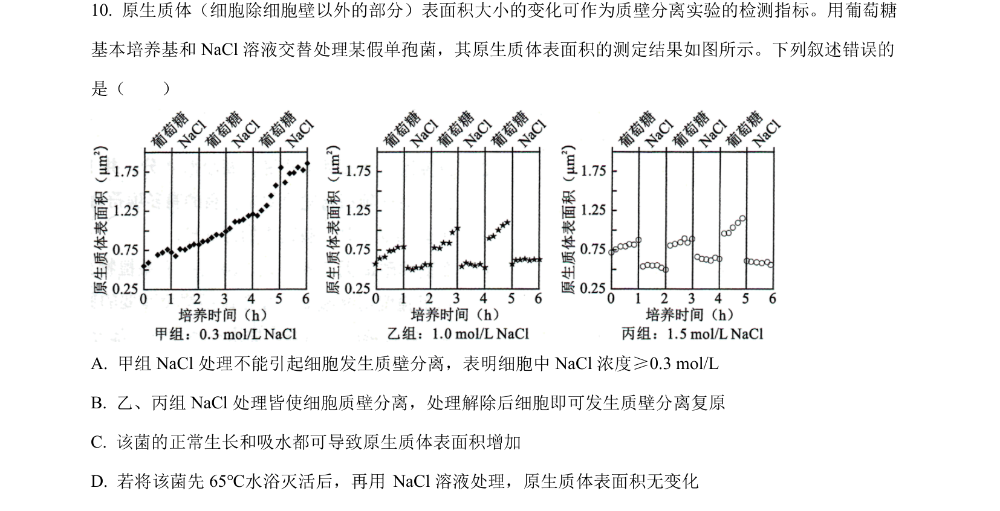
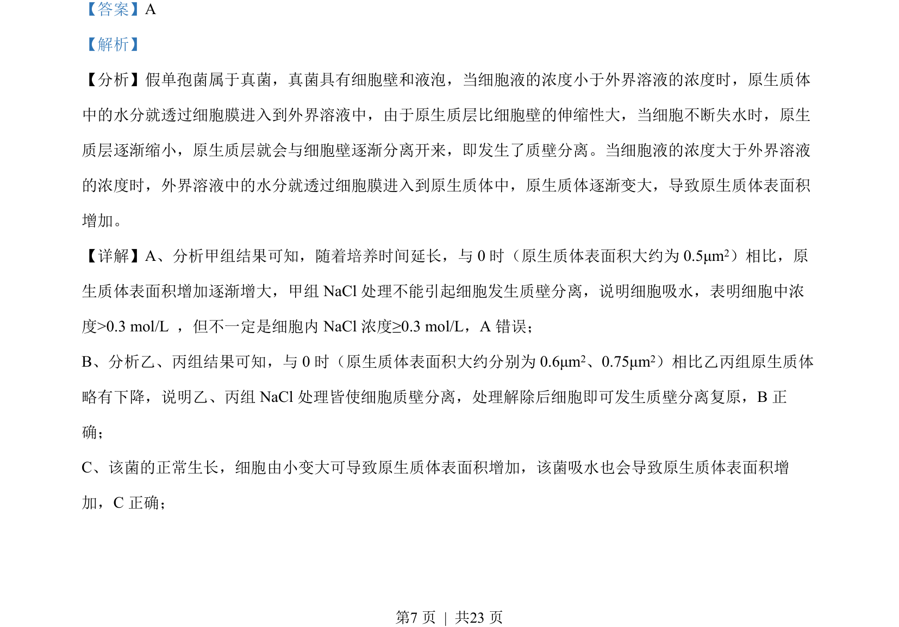
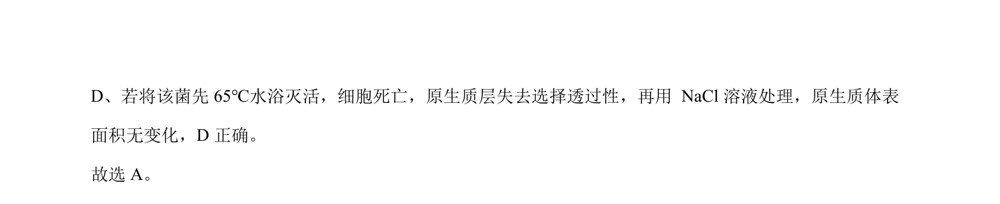

## 题面

## 摘要

考查质壁分离及复原实验分析，涉及渗透吸水与失水条件、细胞活性对质壁分离的影响。

## 关联考点

- [[873-质壁分离与复原|质壁分离与复原]]
- [[258-渗透作用|渗透作用]]
- [[887-原生质体|原生质体]]
- [[细胞活性]]

## 答案与解析

> 📄 原 PDF 第 7 页：`素材/真题/湖南/2008-2024·（湖南）生物高考真题/2022年高考生物试卷（湖南）（解析卷）.pdf`
