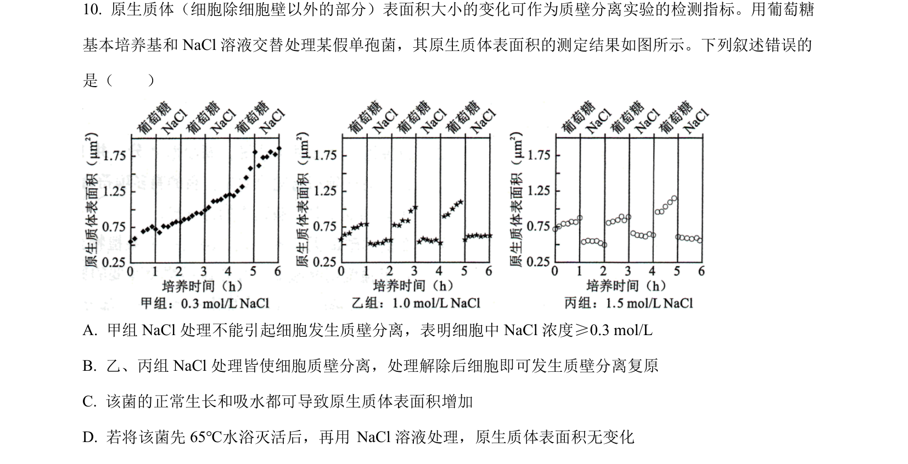
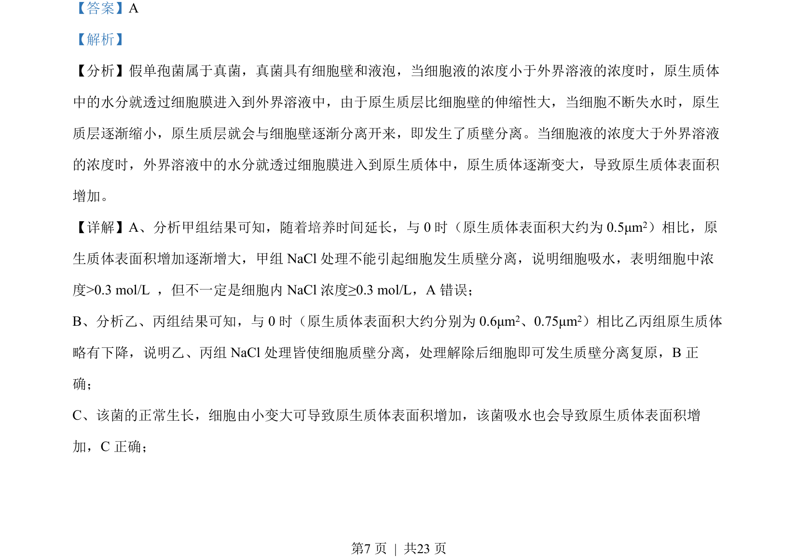
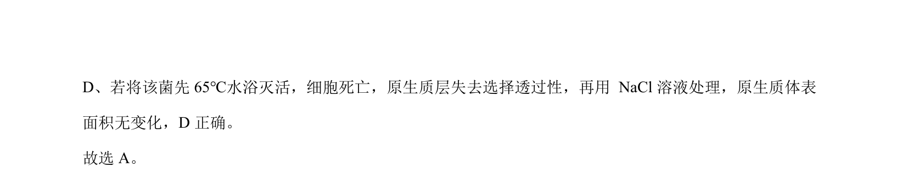

## 题面

## 摘要

考查质壁分离及复原实验分析，涉及渗透吸水与失水条件、细胞活性对质壁分离的影响。

## 关联考点

- [[873-质壁分离与复原|质壁分离与复原]]
- [[258-渗透作用|渗透作用]]
- [[887-原生质体|原生质体]]
- [[细胞活性]]

## 答案与解析

> 📄 原 PDF 第 7 页：`素材/真题/湖南/2008-2024·（湖南）生物高考真题/2022年高考生物试卷（湖南）（解析卷）.pdf`

<!-- 题干文本-start -->
## 题干文本
10. 原生质体（细胞除细胞壁以外的部分）表面积大小的变化可作为质壁分离实验的检测指标。用葡萄糖
基本培养基和 NaCl溶液交替处理某假单孢菌，其原生质体表面积的测定结果如图所示。下列叙述错误的
是（　　）
A. 甲组 NaCl处理不能引起细胞发生质壁分离，表明细胞中 NaCl浓度≥0.3 mol/L
B. 乙、丙组 NaCl处理皆使细胞质壁分离，处理解除后细胞即可发生质壁分离复原
C. 该菌的正常生长和吸水都可导致原生质体表面积增加
D. 若将该菌先 65℃水浴灭活后，再用 NaCl 溶液处理，原生质体表面积无变化
<!-- 题干文本-end -->

<!-- 解析文本-start -->
## 解析文本
【答案】A
【解析】
【分析】假单孢菌属于真菌，真菌具有细胞壁和液泡，当细胞液的浓度小于外界溶液的浓度时，原生质体
中的水分就透过细胞膜进入到外界溶液中，由于原生质层比细胞壁的伸缩性大，当细胞不断失水时，原生
质层逐渐缩小，原生质层就会与细胞壁逐渐分离开来，即发生了质壁分离。当细胞液的浓度大于外界溶液
的浓度时，外界溶液中的水分就透过细胞膜进入到原生质体中，原生质体逐渐变大，导致原生质体表面积
增加。
【详解】A、分析甲组结果可知，随着培养时间延长，与 0 时（原生质体表面积大约为 0.5μm2）相比，原
生质体表面积增加逐渐增大，甲组 NaCl处理不能引起细胞发生质壁分离，说明细胞吸水，表明细胞中浓
度>0.3 mol/L ，但不一定是细胞内 NaCl浓度≥0.3 mol/L，A 错误；
B、分析乙、丙组结果可知，与 0 时（原生质体表面积大约分别为 0.6μm2、0.75μm2）相比乙丙组原生质体
略有下降，说明乙、丙组 NaCl处理皆使细胞质壁分离，处理解除后细胞即可发生质壁分离复原，B正
确；
C、该菌的正常生长，细胞由小变大可导致原生质体表面积增加，该菌吸水也会导致原生质体表面积增
加，C正确；
<!-- 解析文本-end -->
