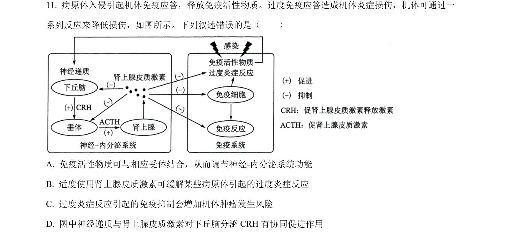
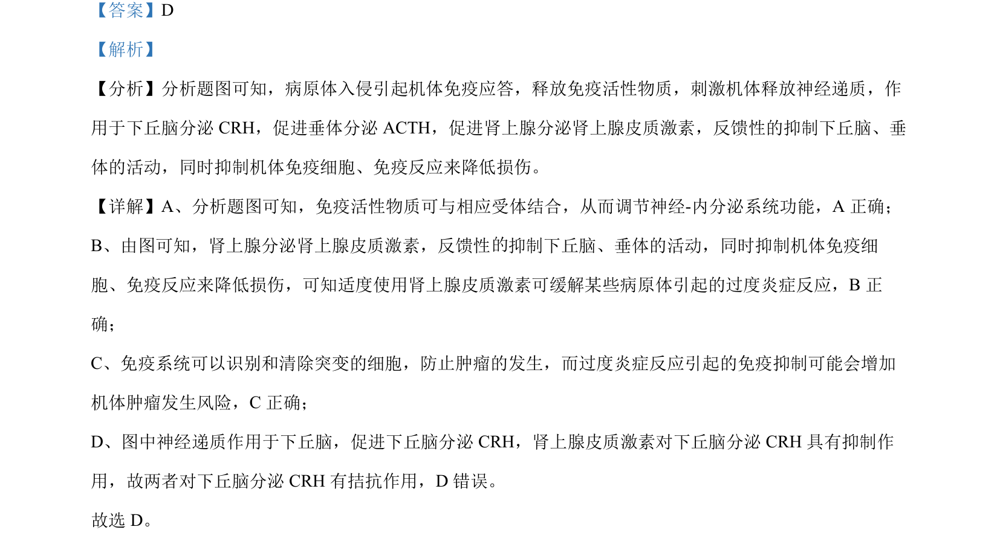

## 题面

## 摘要

本题考查神经-内分泌-免疫调节网络中的反馈调节与激素相互作用。

## 关联考点

- [[156-免疫|免疫调节]]
- [[334-反馈调节|反馈调节]]
- [[662-神经-体液调节|神经-体液调节]]
- [[拮抗作用]]

## 答案与解析

> 📄 原 PDF 第 8 页：`素材/真题/湖南/2008-2024·（湖南）生物高考真题/2022年高考生物试卷（湖南）（解析卷）.pdf`
