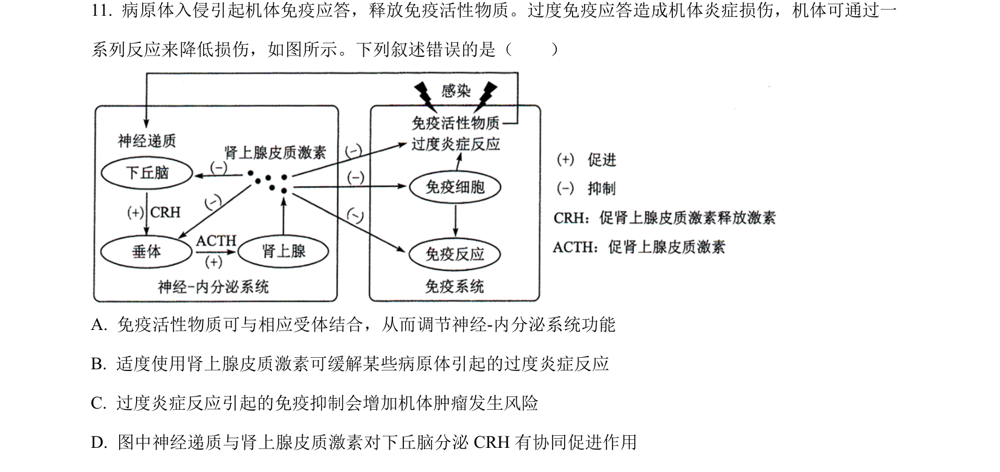
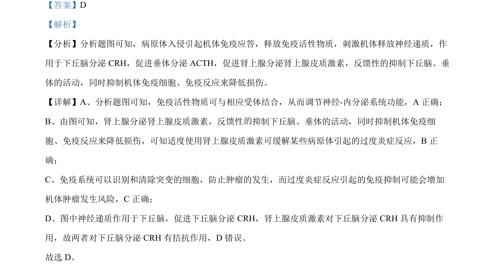

## 题面

## 摘要

本题考查神经-内分泌-免疫调节网络中的反馈调节与激素相互作用。

## 关联考点

- [[156-免疫|免疫调节]]
- [[334-反馈调节|反馈调节]]
- [[662-神经-体液调节|神经-体液调节]]
- [[拮抗作用]]

## 答案与解析

> 📄 原 PDF 第 8 页：`素材/真题/湖南/2008-2024·（湖南）生物高考真题/2022年高考生物试卷（湖南）（解析卷）.pdf`

<!-- 题干文本-start -->
## 题干文本
11. 病原体入侵引起机体免疫应答，释放免疫活性物质。过度免疫应答造成机体炎症损伤，机体可通过一
系列反应来降低损伤，如图所示。下列叙述错误的是（　　）
A. 免疫活性物质可与相应受体结合，从而调节神经-内分泌系统功能
B. 适度使用肾上腺皮质激素可缓解某些病原体引起的过度炎症反应
C. 过度炎症反应引起的免疫抑制会增加机体肿瘤发生风险
D. 图中神经递质与肾上腺皮质激素对下丘脑分泌 CRH 有协同促进作用
<!-- 题干文本-end -->

<!-- 解析文本-start -->
## 解析文本
【答案】D
【解析】
【分析】分析题图可知，病原体入侵引起机体免疫应答，释放免疫活性物质，刺激机体释放神经递质，作
用于下丘脑分泌 CRH，促进垂体分泌 ACTH，促进肾上腺分泌肾上腺皮质激素，反馈性的抑制下丘脑、垂
体的活动，同时抑制机体免疫细胞、免疫反应来降低损伤。
【详解】A、分析题图可知，免疫活性物质可与相应受体结合，从而调节神经-内分泌系统功能，A 正确；
B、由图可知，肾上腺分泌肾上腺皮质激素，反馈性 抑制下丘脑、垂体的活动，同时抑制机体免疫细
胞、免疫反应来降低损伤，可知适度使用肾上腺皮质激素可缓解某些病原体引起的过度炎症反应，B正
确；
C、免疫系统可以识别和清除突变的细胞，防止肿瘤的发生，而过度炎症反应引起的免疫抑制可能会增加
机体肿瘤发生风险，C正确；
D、图中神经递质作用于下丘脑，促进下丘脑分泌 CRH，肾上腺皮质激素对下丘脑分泌 CRH 具有抑制作
用，故两者对下丘脑分泌 CRH 有拮抗作用，D 错误。
故选 D。
<!-- 解析文本-end -->
