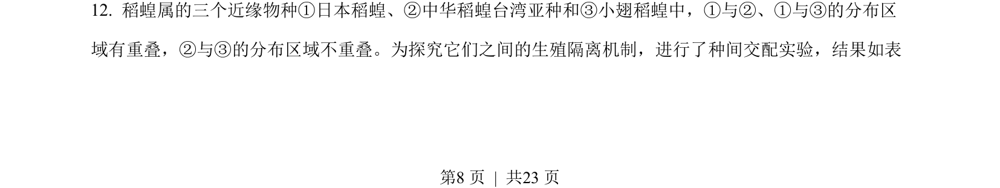
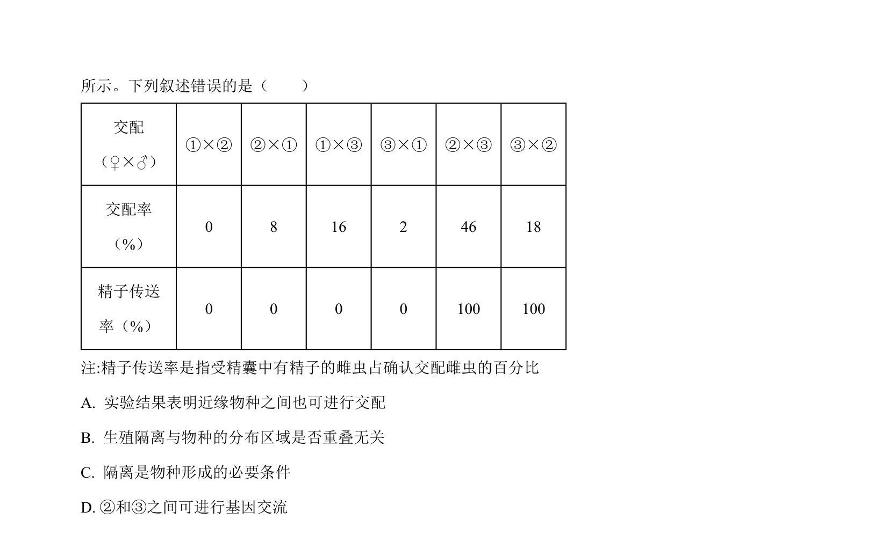
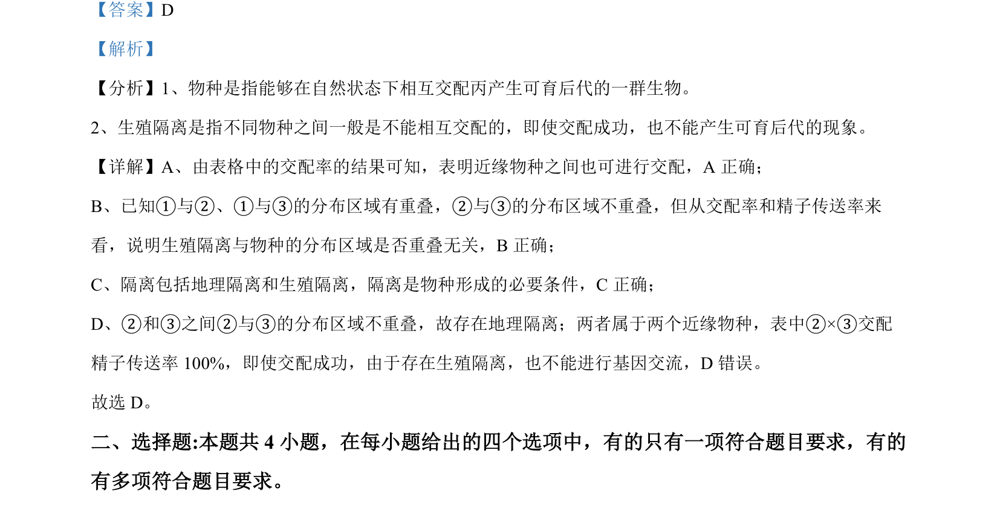

## 题面

## 摘要

结合交配率和精子传送率数据，判断物种概念、生殖隔离与地理隔离的关系。

## 关联考点

- [[390-species|物种]]
- [[897-生殖隔离|生殖隔离]]
- [[572-地理隔离|地理隔离]]
- [[基因交流]]

## 答案与解析

> 📄 原 PDF 第 8 页：`素材/真题/湖南/2008-2024·（湖南）生物高考真题/2022年高考生物试卷（湖南）（解析卷）.pdf`
