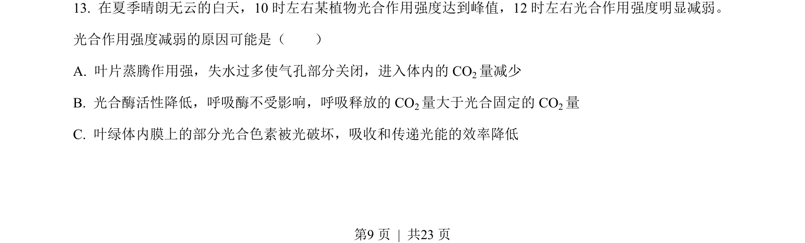
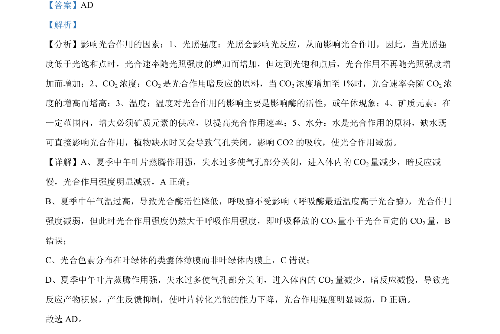

## 题面

## 摘要

该题考查大肠杆菌核糖体蛋白通过结合自身mRNA抑制翻译的调节机制。

## 关联考点

- [[核糖体蛋白]]
- [[翻译抑制]]
- [[mRNA结合位点]]
- [[数量平衡]]

## 答案与解析

> 📄 原 PDF 第 9 页：`素材/真题/湖南/2008-2024·（湖南）生物高考真题/2022年高考生物试卷（湖南）（解析卷）.pdf`

<!-- 题干文本-start -->
## 题干文本
13. 在夏季晴朗无云的白天，10 时左右某植物光合作用强度达到峰值，12 时左右光合作用强度明显减弱。
光合作用强度减弱的原因可能是（　　）
A. 叶片蒸腾作用强，失水过多使气孔部分关闭，进入体内的 CO2量减少
B. 光合酶活性降低，呼吸酶不受影响，呼吸释放的 CO2量大于光合固定的 CO2量
C. 叶绿体内膜上的部分光合色素被光破坏，吸收和传递光能的效率降低
<!-- 题干文本-end -->

<!-- 解析文本-start -->
## 解析文本

<!-- 解析文本-end -->
