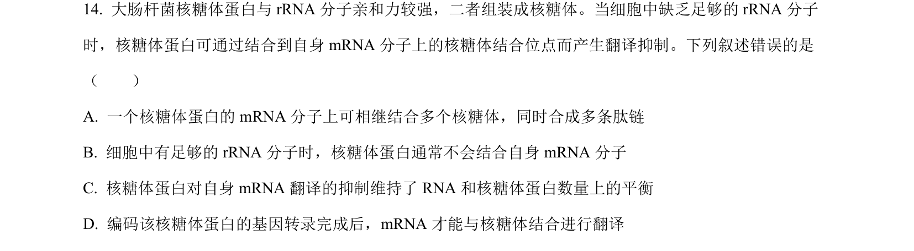
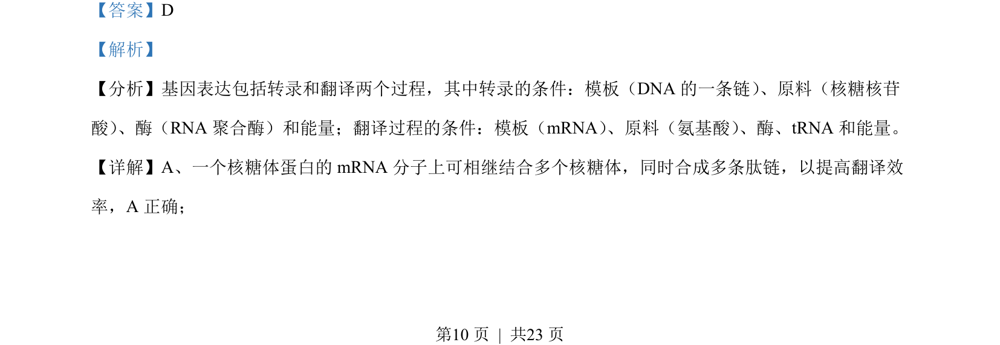
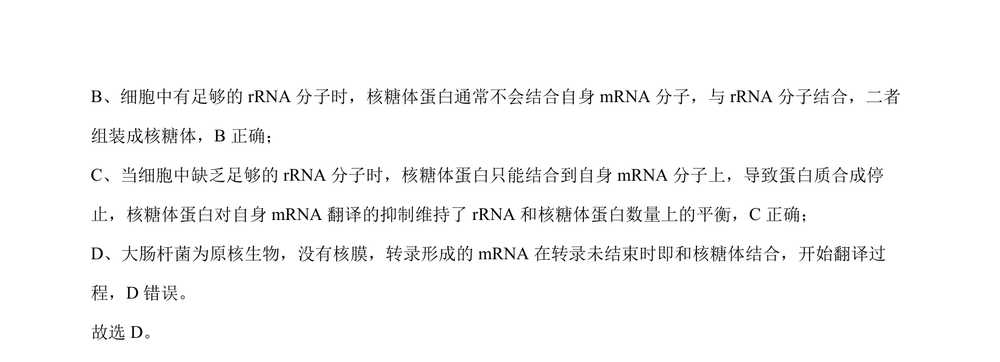

## 题面

## 摘要

该题考查核糖体蛋白翻译调控的机制，涉及基因表达中转录和翻译过程及原核生物特点。

## 关联考点

- [[479-基因表达|基因表达]]
- [[466-interpret|翻译]]
- [[225-核糖体|核糖体]]
- [[293-rRNA|rRNA]]

## 答案与解析

> 📄 原 PDF 第 10 页：`素材/真题/湖南/2008-2024·（湖南）生物高考真题/2022年高考生物试卷（湖南）（解析卷）.pdf`
