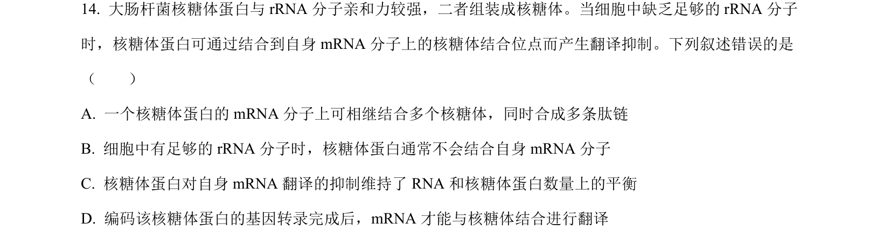
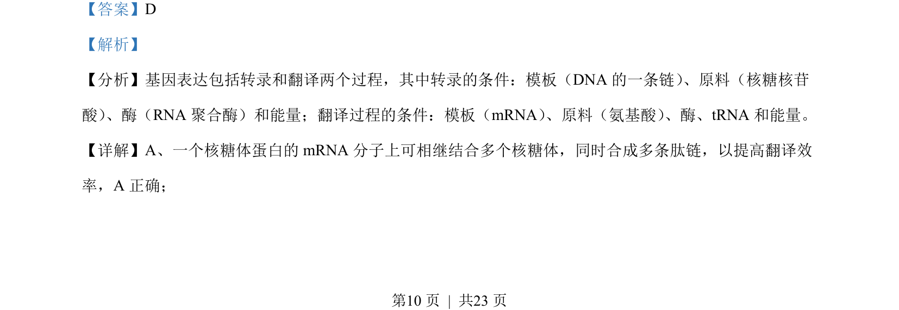
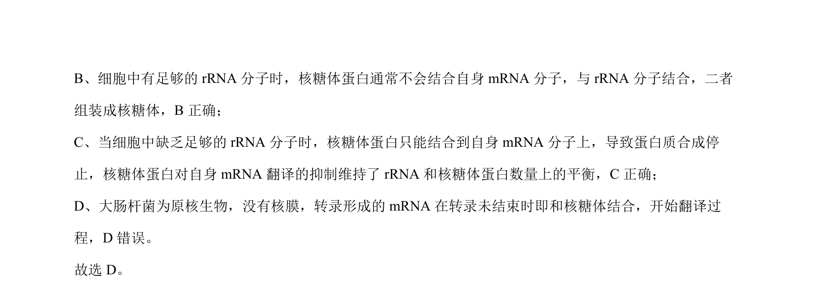

## 题面

## 摘要

该题考查核糖体蛋白翻译调控的机制，涉及基因表达中转录和翻译过程及原核生物特点。

## 关联考点

- [[843-基因的表达|基因表达]]
- [[466-interpret|翻译]]
- [[225-核糖体|核糖体]]
- [[293-rRNA|rRNA]]

## 答案与解析

> 📄 原 PDF 第 10 页：`素材/真题/湖南/2008-2024·（湖南）生物高考真题/2022年高考生物试卷（湖南）（解析卷）.pdf`

<!-- 题干文本-start -->
## 题干文本
14. 大肠杆菌核糖体蛋白与 rRNA 分子亲和力较强，二者组装成核糖体。当细胞中缺乏足够的 rRNA 分子
时，核糖体蛋白可通过结合到自身 mRNA 分子上的核糖体结合位点而产生翻译抑制。下列叙述错误的是
（　　）
A. 一个核糖体蛋白的 mRNA 分子上可相继结合多个核糖体，同时合成多条肽链
B. 细胞中有足够的 rRNA 分子时，核糖体蛋白通常不会结合自身 mRNA 分子
C. 核糖体蛋白对自身 mRNA 翻译的抑制维持了 RNA 和核糖体蛋白数量上的平衡
D. 编码该核糖体蛋白的基因转录完成后，mRNA 才能与核糖体结合进行翻译
<!-- 题干文本-end -->

<!-- 解析文本-start -->
## 解析文本
【答案】D
【解析】
【分析】基因表达包括转录和翻译两个过程，其中转录的条件：模板（DNA 的一条链） 、原料（核糖核苷
酸） 、酶（RNA 聚合酶）和能量；翻译过程的条件：模板（mRNA） 、原料（氨基酸） 、酶、tRNA 和能量。
【详解】A、一个核糖体蛋白的 mRNA 分子上可相继结合多个核糖体，同时合成多条肽链，以提高翻译效
率，A 正确；
<!-- 解析文本-end -->
